---
## Front matter
lang: ru-RU
title: "Лабораторная работа №2"
subtitle: "Первоночальная настройка git"
author:
  - Митрофанов Тимур Александрович
institute:
  - Российский университет дружбы народов, Москва, Россия
  
date: 02 марта 2024

## i18n babel
babel-lang: russian
babel-otherlangs: english

## Formatting pdf
toc: false
toc-title: Содержание
slide_level: 2
aspectratio: 169
section-titles: true
theme: metropolis
header-includes:
 - \metroset{progressbar=frametitle,sectionpage=progressbar,numbering=fraction}
 - '\makeatletter'
 - '\beamer@ignorenonframefalse'
 - '\makeatother'
 
## Fonts
mainfont: PT Serif
romanfont: PT Serif
sansfont: PT Sans
monofont: PT Mono
mainfontoptions: Ligatures=TeX
romanfontoptions: Ligatures=TeX
sansfontoptions: Ligatures=TeX,Scale=MatchLowercase
monofontoptions: Scale=MatchLowercase,Scale=0.9

---

# Информация

## Докладчик

:::::::::::::: {.columns align=center}
::: {.column width="70%"}

  * Митрофанов Тимур Александрович
  * Студент 1 курса
  * Российский университет дружбы народов
  * [1132231842@pfur.ru](1132231842@pfur.ru)

:::
::: {.column width="30%"}

:::
::::::::::::::

## Цель работы

Изучить идеологии и примечание средств контроля версий. Освоение умений по работе с git.

## Выполнение лабораторной работы

 Заходим в терминал и устанавливаем git,используя команду ***dnf install git***.

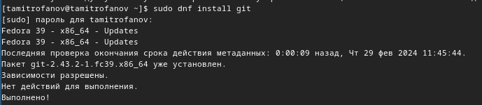{#fig:001 width=70%}

##

 Устанавливаем gh, используя команду ***dnf install gh***.

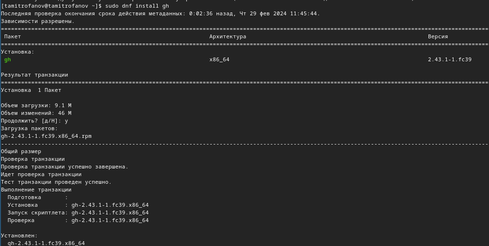{#fig:002 width=70%}

##

Теперь настроим git.

Пользуясь командой ***git config --global user.name "Timur Mitrofanov"*** задаём свое имя, а командой ***git config --global user.email "mitrofanov-t@bk.ru"*** задаю свой email. Настроиваем utf-8 в выводе сообщений git командой ***git config --global core.quotepath false***.

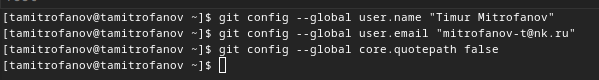{#fig:003 width=70%}

##

Задаём имя начальной ветки, название-master, командой ***git config --global init.defaultBranch master***. Затем настраиваем параметры autocrlf(***git config --global core.autocrlf input***) и safecrlf(***git config --global core.safecrlf warn***).

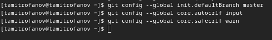{#fig:004 width=70%}

##

Создаём ключ по алгоритму rsa с ключём размером 4096 бит.

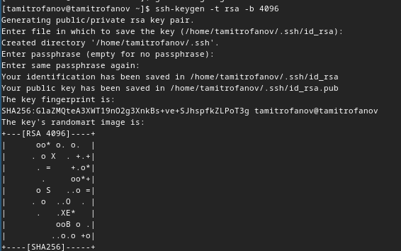{#fig:005 width=70%}

##

Создаём ключ по алгоритму ed25519, используя команду ***ssh keygen -t***.
 
 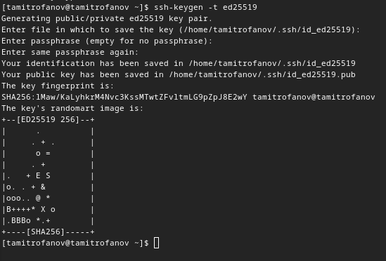{#fig:006 width=70%}
 
##
 
Генерируем ключ, командой ***gpg --full-generate-key***.
 
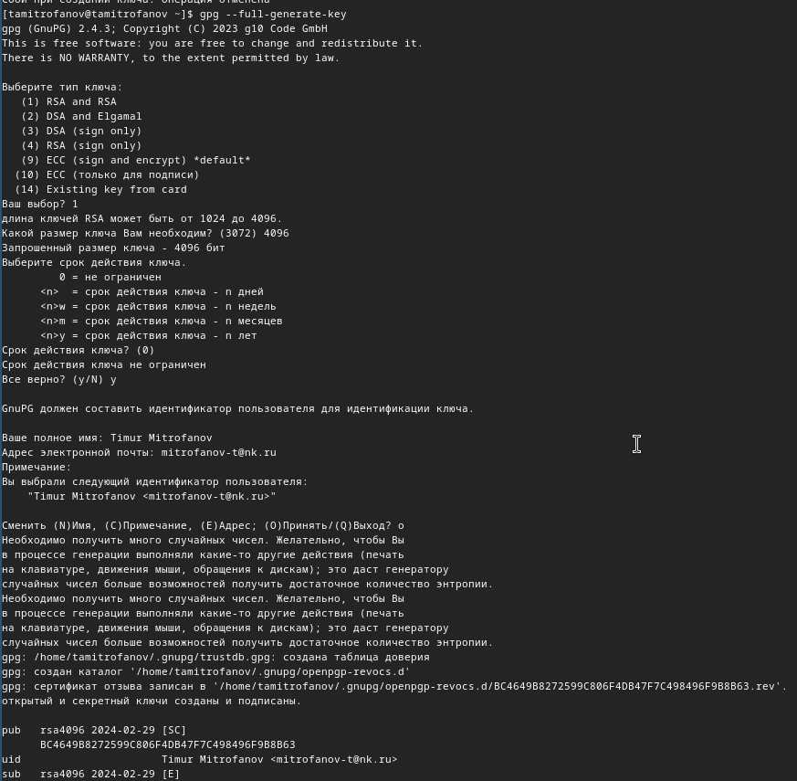{#fig:007 width=70%}
 
##

 Выводим список ключей,командой ***gpg --list-secret-keys --keyid-format LONG***.
 
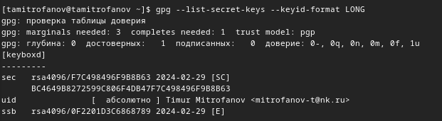{#fig:008 width=70%}
 
##
 
Копируем сгенерированный PGP ключ в буфер обмена, командой ***gpg --armor --export  ключ  | cat***, перед эти установив команду xclip.
 
 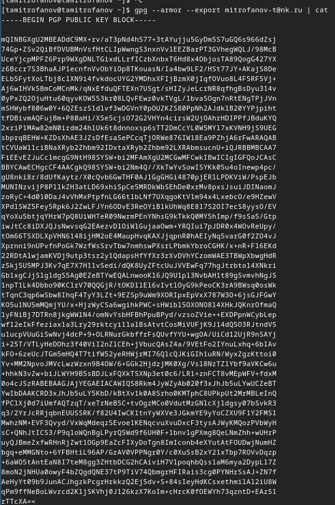{#fig:009 width=70%}
 
##

 Переходим в настройки GitHub, нажимаем на кнопку New GPG key и вставляем полученный ключ в поле ввода. , далее получаю сгенерированный ключ

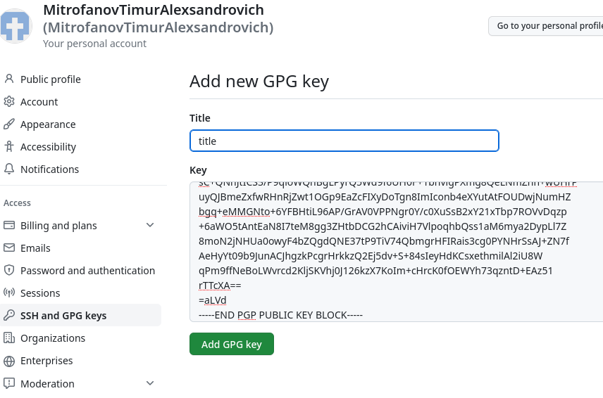{#fig:010 width=70%}

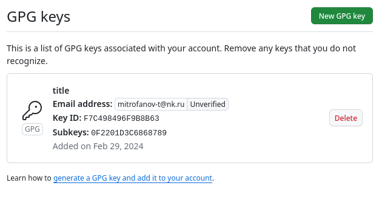{#fig:011 width=70%}

##

Используя введёный email, укажем Git применять его при подписи коммитов ***git config --global user.signingkey email***

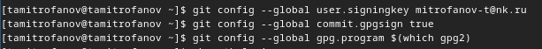{#fig:012 width=70%}

##

Используя команду ***gh auth login***, авторизуемся через браузер

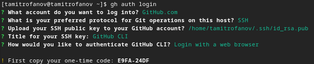{#fig:013 width=70%}

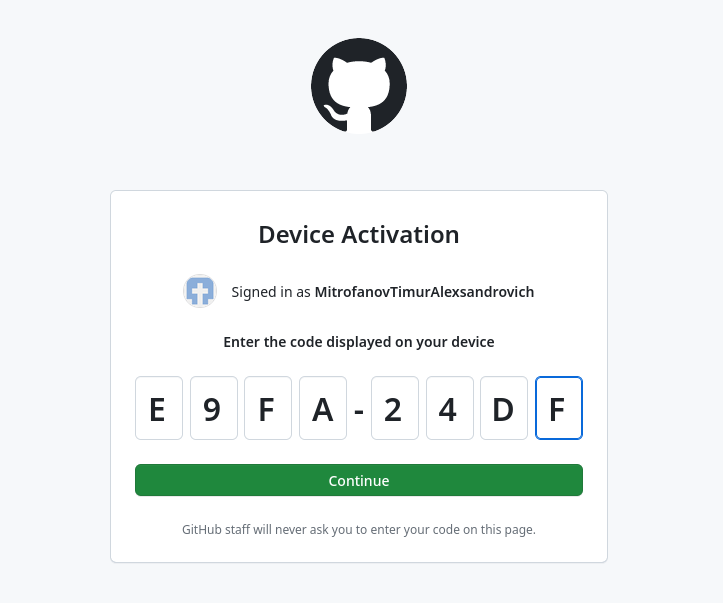{#fig:014 width=70%}

##

Создаём каталог, в котором мы будем дальше работать, переходим в него, используя команды ***mkdir*** и ***cd***

Далее создаём репозиторий на основе шаблона, с помощью команды ***gh repo create study_2022-2023_os-intro --template=yamadharma/course-directory-student-template --public***. После клонируем репозиторий, командой ***git clone --recursive git@github.com:aseltoichubekova/study_2022-2023_os-intro.git os-intro***

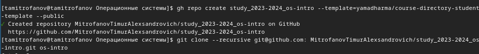{#fig:015 width=70%}

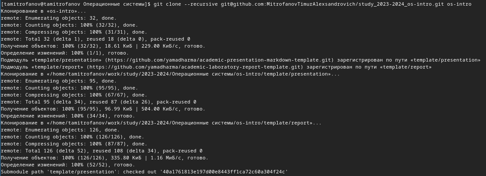{#fig:016 width=70%}

##

Переходим в каталог курса ***cd os-intro*** и удаляем лишний файл ***rm package.json***

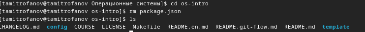{#fig:017 width=70%}

##

Создаём необходимые каталоги, используя команды ***echo os-intro > COURSE***, затем ***make***

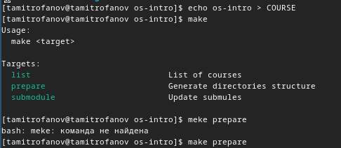{#fig:018 width=70%}

##

Отправляем файлы на сервер ***git add .*** и ***git commit -am 'feat(main): make course structure'***.

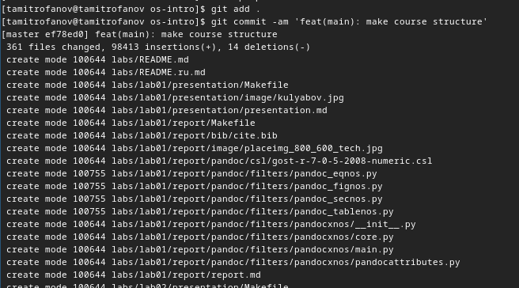{#fig:019 width=70%}

##

***git push***.

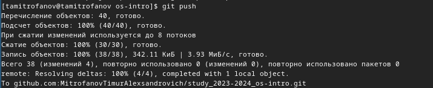{#fig:020 width=70%}

##

Зайдем в github и увидим репозиторий созданный по шаблону

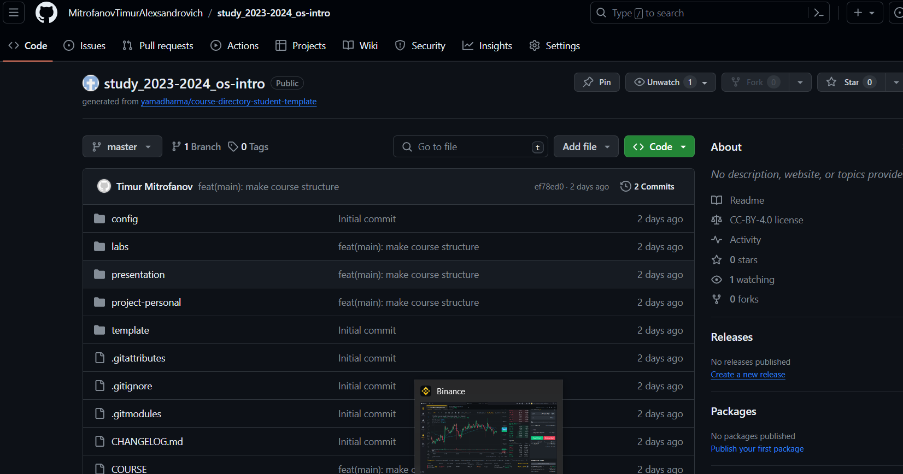{#fig:021 width=70%}

# Выводы

В этой лабораторной работе я изучил идеологии и примечание средств контроля версий. Освоенил умений по работе с git.

