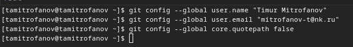

---
## Front matter
title: "Лабораторная работа №2"
subtitle: "Первоночальная настройка git"
author: "Митрофанов Тимур Александрович"

## Generic otions
lang: ru-RU
toc-title: "Содержание"

## Bibliography
bibliography: bib/cite.bib
csl: pandoc/csl/gost-r-7-0-5-2008-numeric.csl

## Pdf output format
toc: true # Table of contents
toc-depth: 2
lof: true # List of figures
fontsize: 12pt
linestretch: 1.5
papersize: a4
documentclass: scrreprt
## I18n polyglossia
polyglossia-lang:
  name: russian
  options:
	- spelling=modern
	- babelshorthands=true
polyglossia-otherlangs:
  name: english
## I18n babel
babel-lang: russian
babel-otherlangs: english
## Fonts
mainfont: PT Serif
romanfont: PT Serif
sansfont: PT Sans
monofont: PT Mono
mainfontoptions: Ligatures=TeX
romanfontoptions: Ligatures=TeX
sansfontoptions: Ligatures=TeX,Scale=MatchLowercase
monofontoptions: Scale=MatchLowercase,Scale=0.9
## Biblatex
biblatex: true
biblio-style: "gost-numeric"
biblatexoptions:
  - parentracker=true
  - backend=biber
  - hyperref=auto
  - language=auto
  - autolang=other*
  - citestyle=gost-numeric
## Pandoc-crossref LaTeX customization
figureTitle: "Рис."
tableTitle: "Таблица"
lofTitle: "Список иллюстраций"

## Misc options
indent: true
header-includes:
  - \usepackage{indentfirst}
  - \usepackage{float} # keep figures where there are in the text
  - \floatplacement{figure}{H} # keep figures where there are in the text
---

# Цель работы

Изучить идеологии и примечание средств контроля версий. Освоение умений по работе с git.

# Выполнение лабораторной работы

 Заходим в терминал и устанавливаем git,используя команду ***dnf install git***. (рис. [-@fig:001])

{#fig:001 width=70%}

 Устанавливаем gh, используя команду ***dnf install gh***. (рис. [-@fig:002])

{#fig:002 width=70%}

Теперь настроим git.

Пользуясь командой ***git config --global user.name "Timur Mitrofanov"*** задаём свое имя, а командой ***git config --global user.email "mitrofanov-t@bk.ru"*** задаю свой email. Настроиваем utf-8 в выводе сообщений git командой ***git config --global core.quotepath false***. (рис. [-@fig:003])

{#fig:003 width=70%}

Задаём имя начальной ветки, название-master, командой ***git config --global init.defaultBranch master***. Затем настраиваем параметры autocrlf(***git config --global core.autocrlf input***) и safecrlf(***git config --global core.safecrlf warn***).   (рис. [-@fig:004])

{#fig:004 width=70%}

Создаём ключ по алгоритму rsa с ключём размером 4096 бит. (рис. [-@fig:005])

{#fig:005 width=70%}

Создаём ключ по алгоритму ed25519, используя команду ***ssh keygen -t***. (рис. [-@fig:006])
 
 {#fig:006 width=70%}
 

 
Генерируем ключ, командой ***gpg --full-generate-key***. (рис. [-@fig:007]
 
 {#fig:007 width=70%}

 Выводим список ключей,командой ***gpg --list-secret-keys --keyid-format LONG***. (рис. [-@fig:008])
 
 {#fig:008 width=70%}
 
Копируем сгенерированный PGP ключ в буфер обмена, командой ***gpg --armor --export  ключ  | cat***, перед эти установив команду xclip. (рис. [-@fig:009])
 
 {#fig:009 width=70%}

 Переходим в настройки GitHub, нажимаем на кнопку New GPG key и вставляем полученный ключ в поле ввода. (рис. [-@fig:010]) , далее получаю сгенерированный ключ (рис. [-@fig:011])

{#fig:010 width=70%}

{#fig:011 width=70%}

Используя введёный email, укажем Git применять его при подписи коммитов ***git config --global user.signingkey email*** (рис. [-@fig:012])

{#fig:012 width=70%}

Используя команду ***gh auth login***, авторизуемся через браузер (рис. [-@fig:013] и рис. [-@fig:014])

{#fig:013 width=70%}

{#fig:014 width=70%}

Создаём каталог, в котором мы будем дальше работать, переходим в него, используя команды ***mkdir*** и ***cd***

Далее создаём репозиторий на основе шаблона, с помощью команды ***gh repo create study_2022-2023_os-intro --template=yamadharma/course-directory-student-template --public***.(рис. [-@fig:015]) После клонируем репозиторий, командой ***git clone --recursive git@github.com:aseltoichubekova/study_2022-2023_os-intro.git os-intro***(рис. [-@fig:016])

{#fig:015 width=70%}

{#fig:016 width=70%}

Переходим в каталог курса ***cd os-intro*** и удаляем лишний файл ***rm package.json*** (рис [-@fig:017])

{#fig:017 width=70%}

Создаём необходимые каталоги, используя команды ***echo os-intro > COURSE***, затем ***make*** (рис [-@fig:018])

{#fig:018 width=70%}

Отправляем файлы на сервер ***git add .*** и ***git commit -am 'feat(main): make course structure'***. (рис [-@fig:019])

{#fig:019 width=70%}

***git push***.(рис [-@fig:020])

{#fig:020 width=70%}

Зайдем в github и увидим репозиторий созданный по шаблону (рис [-@fig:021])

{#fig:021 width=70%}

# Выводы

В этой лабораторной работе я изучил идеологии и примечание средств контроля версий. Освоенил умений по работе с git.

