---
## Front matter
lang: ru-RU
title: "Лабораторная работа №2"
subtitle: "Первоночальная настройка git"
author:
  - Митрофанов Тимур Александрович
institute:
  - Российский университет дружбы народов, Москва, Россия
  
date: 02 марта 2024

## i18n babel
babel-lang: russian
babel-otherlangs: english

## Formatting pdf
toc: false
toc-title: Содержание
slide_level: 2
aspectratio: 169
section-titles: true
theme: metropolis
header-includes:
 - \metroset{progressbar=frametitle,sectionpage=progressbar,numbering=fraction}
 - '\makeatletter'
 - '\beamer@ignorenonframefalse'
 - '\makeatother'
 
## Fonts
mainfont: PT Serif
romanfont: PT Serif
sansfont: PT Sans
monofont: PT Mono
mainfontoptions: Ligatures=TeX
romanfontoptions: Ligatures=TeX
sansfontoptions: Ligatures=TeX,Scale=MatchLowercase
monofontoptions: Scale=MatchLowercase,Scale=0.9

---

# Информация

## Докладчик

:::::::::::::: {.columns align=center}
::: {.column width="70%"}

  * Митрофанов Тимур Александрович
  * Студент 1 курса
  * Российский университет дружбы народов
  * [1132231842@pfur.ru](1132231842@pfur.ru)

:::
::: {.column width="30%"}

:::
::::::::::::::

## Цель работы

Получить навыки правильной работы с репозиториями git.

## Выполнение лабораторной работы

Разрешаем доступ к репозиторию в которм находится gitflow ***dnf copr enable elegos/gitflow***.

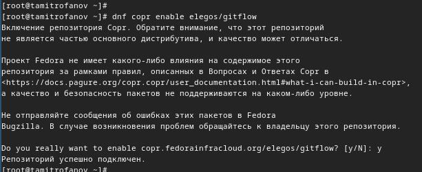{#fig:001 width=70%}

##

Устанавливаем gitflow, используя команду ***dnf install gitflow**.

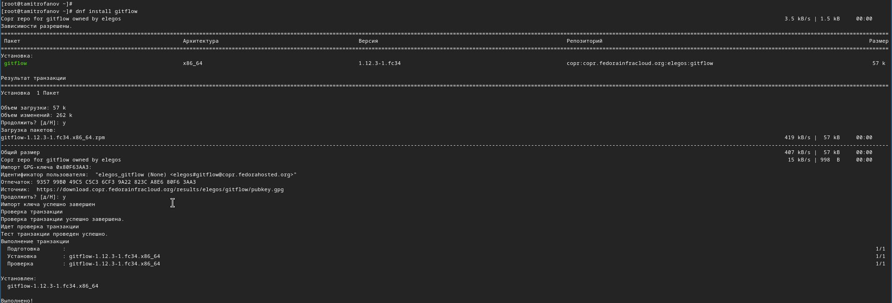{#fig:002 width=70%}

##

Устанавливем Node.js и pnpm

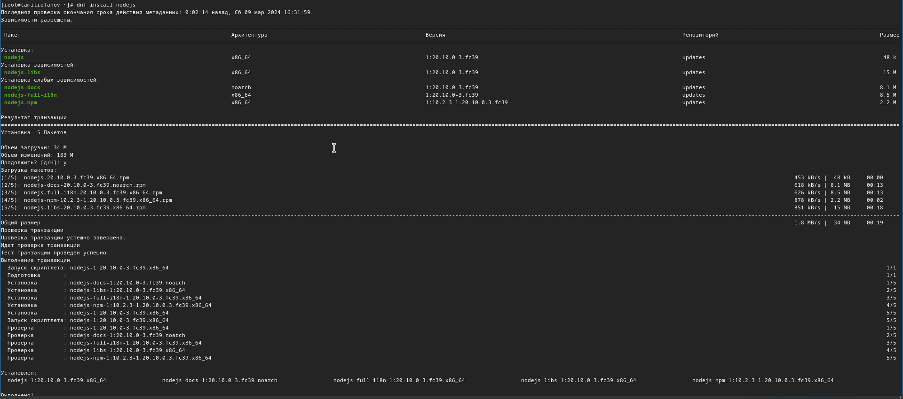{#fig:003 width=70%}

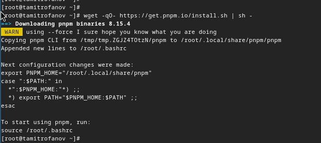{#fig:004 width=70%}

##

Настраиваем Node.js для работы.

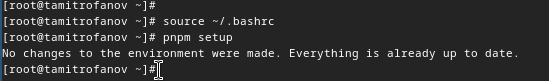{#fig:005 width=70%}

##

При помощи команды ***pnpm add -g commitizen*** устанавливаем программу для помощи в форматировании комитов.

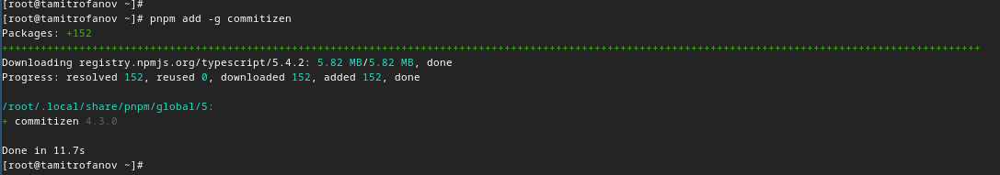{#fig:006 width=70%}

##

При помощи команды ***pnpm add -g standard-changelog*** устанавливаем программу для помощи в создании логов.

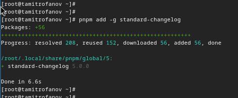{#fig:007 width=70%}

##

Создаём репозитрий git-extended.

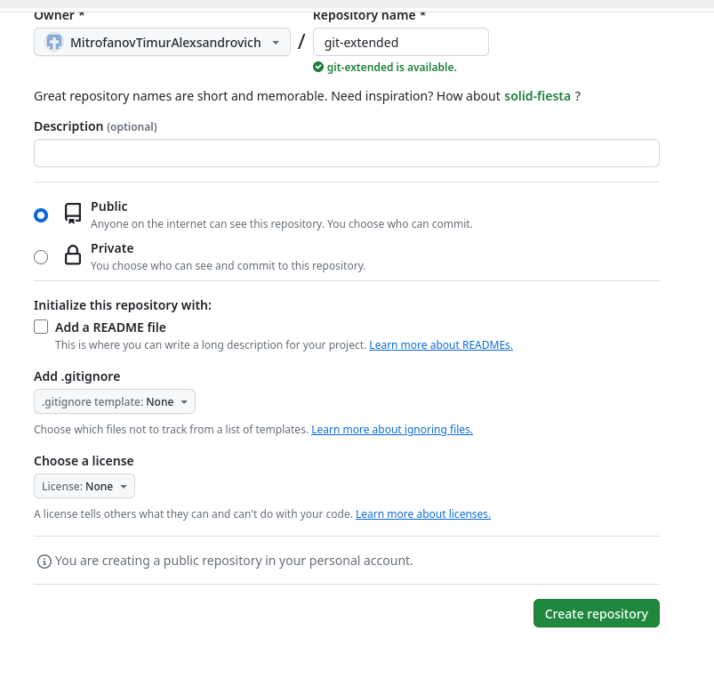{#fig:008 width=70%}

##

Копируем внось созданный репозиторий себе на вирт. машину.

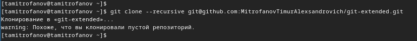{#fig:009 width=70%}

##

Делаем первый комит на репозиторий git-extended.

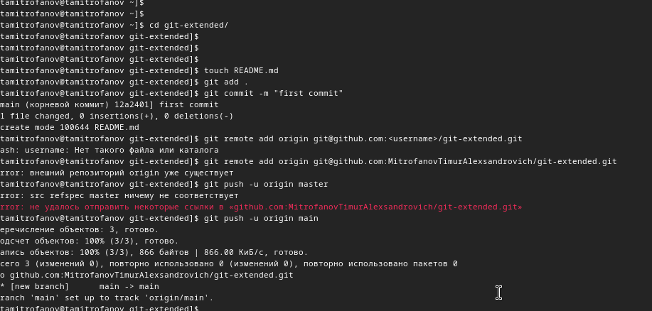{#fig:010 width=70%}

##

Смотри конфигурацию пакетов Node.js.

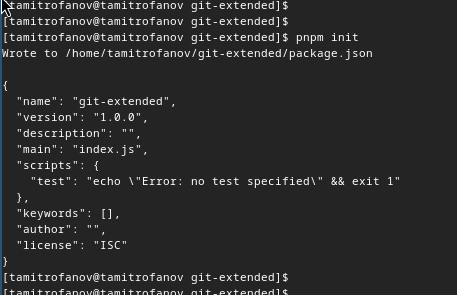{#fig:011 width=70%}

##

Модификация конфигурации Node.js.

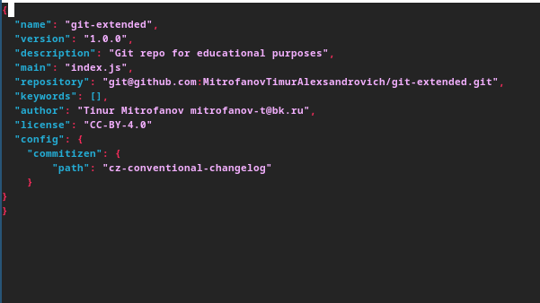{#fig:012 width=70%}

##

Добавляем новые фалый, делаем коммит и отправляем на github.

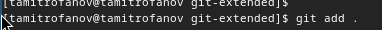{#fig:013 width=70%}

##

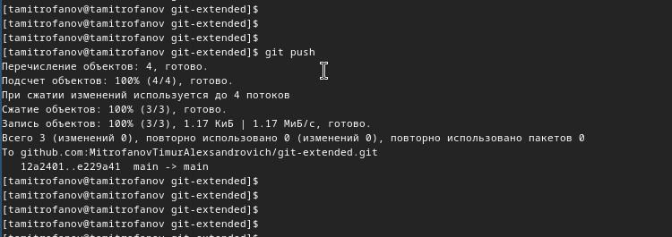{#fig:014 width=70%}

Инициализируем gitflow.

##

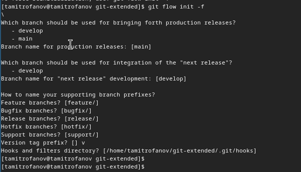{#fig:015 width=70%}

Проверяем в какой мы ветке.

##

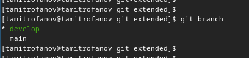{#fig:016 width=70%}

Загружаем всего репозитория в хранилище.

##

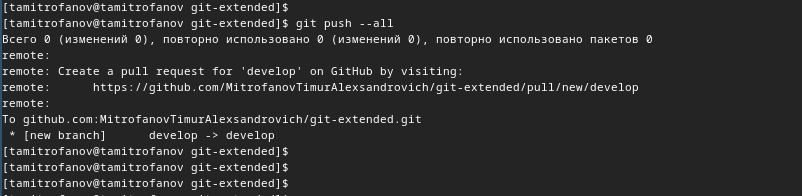{#fig:017 width=70%}

Установливаем внешнюю ветку как вышестоящую для этой ветки при помощи команды ***git branch --set-upstream-to=origin/develop develop***.

##

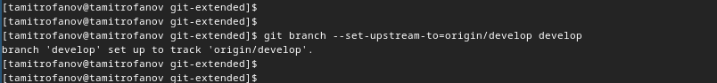{#fig:018 width=70%}

Создадим релиз с версией 1.0.0 при помощи команды ***git flow release start 1.0.0***.
##

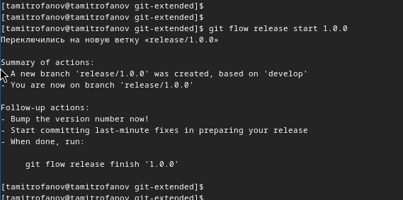{#fig:019 width=70%}

Создадим журнал изменений при помощи команды ***standard-changelog --first-release***.

##

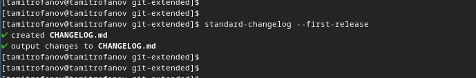{#fig:020 width=70%}

##

Добавим журнал изменений в индекс при помощи команд ***git add CHANGELOG.md*** и ***git commit -am 'chore(site): add changelog'***.

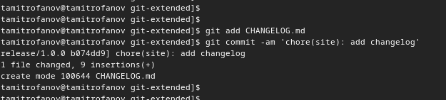{#fig:021 width=70%}

##

Зальём релизную ветку в основную ветку при помощи команды ***git flow release finish 1.0.0***.

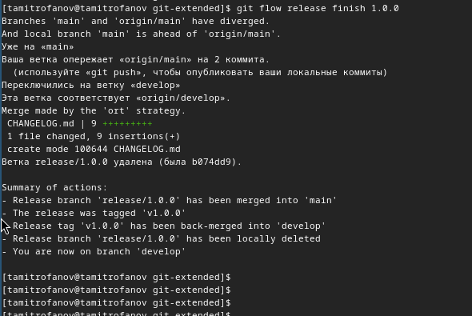{#fig:022 width=70%}

##

Отправим данные на github.

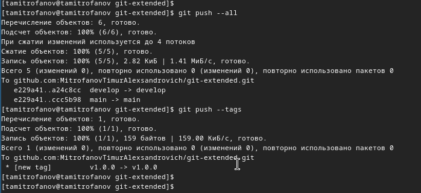{#fig:023 width=70%}

##

Создадим релиз на github. Для этого будем использовать утилиты работы с github.

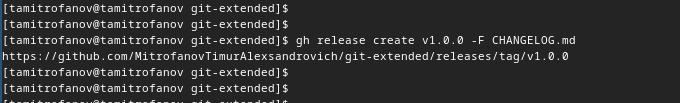{#fig:024 width=70%}

##

Создадим ветку для новой функциональности.

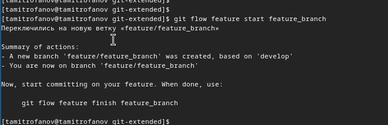{#fig:025 width=70%}

##

По окончании разработки новой функциональности следующим шагом объединим ветку feature_branch c develop.

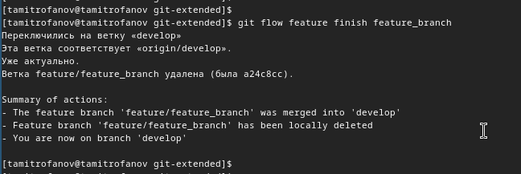{#fig:026 width=70%}

##

Создадим релиз с версией 1.2.3.

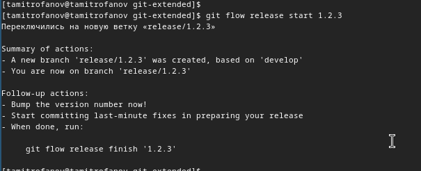{#fig:027 width=70%}

##

Изменений файла конфигурации для соответствия версии релиза.

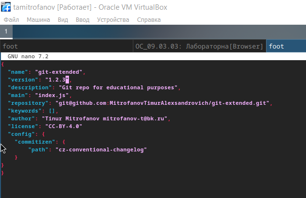{#fig:028 width=70%}

##

Создадим журнал изменений.

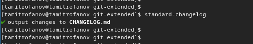{#fig:029 width=70%}

##

Добавим журнал изменений в индекс при помощи команд ***git add CHANGELOG.md*** и ***git commit -am 'chore(site): update changelog'***.

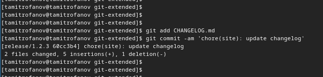{#fig:030 width=70%}

##

Зальём релизную ветку в основную ветку при помощи команды ***git flow release finish 1.2.3***.

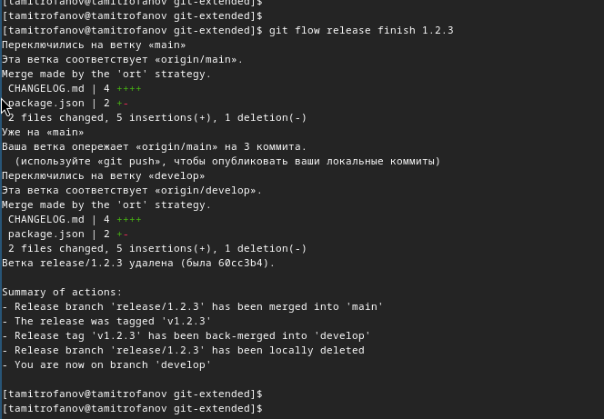{#fig:031 width=70%}

##

Отправим данные на github.

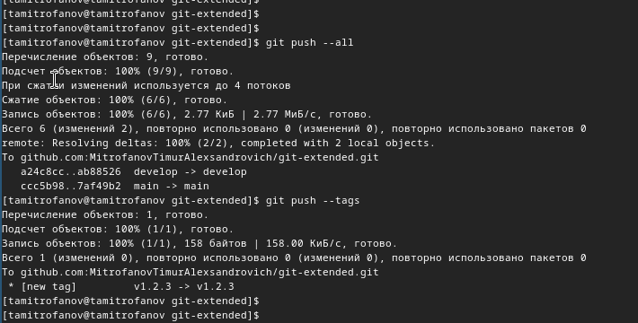{#fig:032 width=70%}

##

Создадим релиз на github. Для этого будем использовать утилиты работы с github.

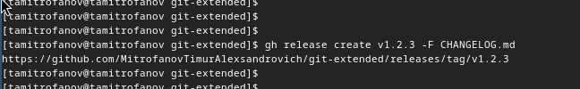{#fig:033 width=70%}

## Выводы

В этой лабораторной работе я получить навыки правильной работы с репозиториями git.

