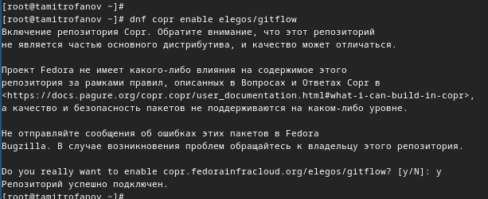
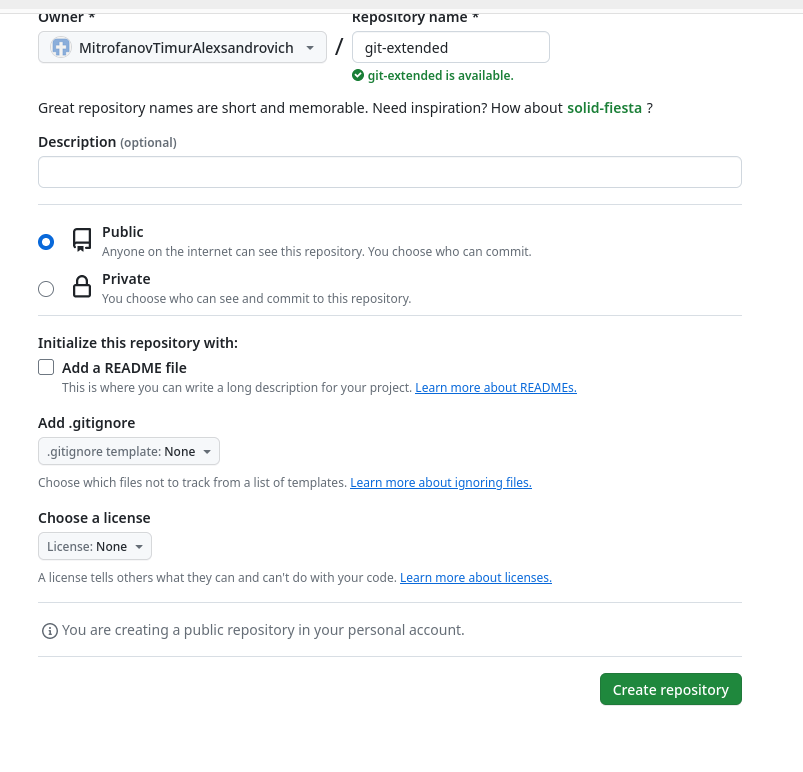
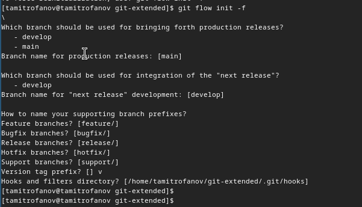
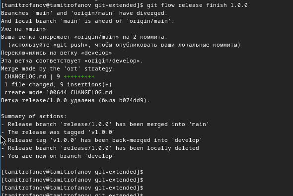
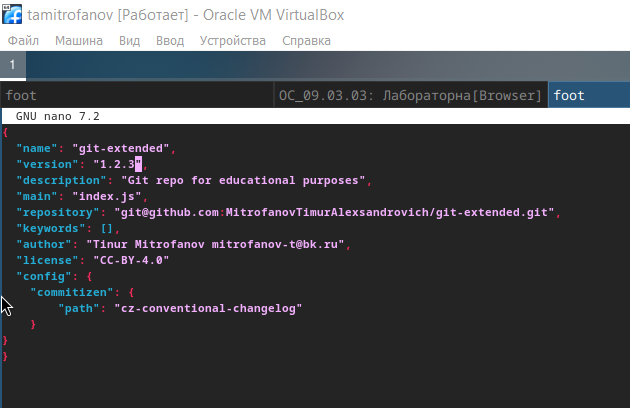
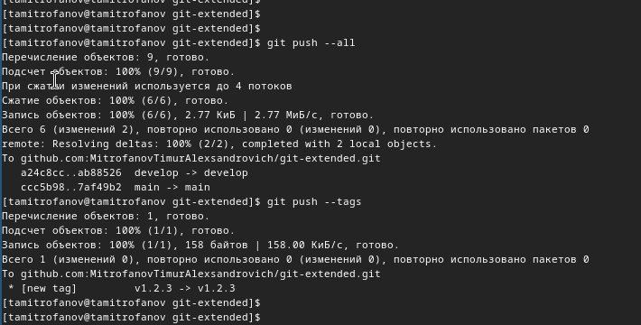

---
## Front matter
title: "Лабораторная работа №4"
subtitle: "Продвинутое использование git."
author: "Митрофанов Тимур Александрович"

## Generic otions
lang: ru-RU
toc-title: "Содержание"

## Bibliography
bibliography: bib/cite.bib
csl: pandoc/csl/gost-r-7-0-5-2008-numeric.csl

## Pdf output format
toc: true # Table of contents
toc-depth: 2
lof: true # List of figures
fontsize: 12pt
linestretch: 1.5
papersize: a4
documentclass: scrreprt
## I18n polyglossia
polyglossia-lang:
  name: russian
  options:
	- spelling=modern
	- babelshorthands=true
polyglossia-otherlangs:
  name: english
## I18n babel
babel-lang: russian
babel-otherlangs: english
## Fonts
mainfont: PT Serif
romanfont: PT Serif
sansfont: PT Sans
monofont: PT Mono
mainfontoptions: Ligatures=TeX
romanfontoptions: Ligatures=TeX
sansfontoptions: Ligatures=TeX,Scale=MatchLowercase
monofontoptions: Scale=MatchLowercase,Scale=0.9
## Biblatex
biblatex: true
biblio-style: "gost-numeric"
biblatexoptions:
  - parentracker=true
  - backend=biber
  - hyperref=auto
  - language=auto
  - autolang=other*
  - citestyle=gost-numeric
## Pandoc-crossref LaTeX customization
figureTitle: "Рис."
tableTitle: "Таблица"
lofTitle: "Список иллюстраций"

## Misc options
indent: true
header-includes:
  - \usepackage{indentfirst}
  - \usepackage{float} # keep figures where there are in the text
  - \floatplacement{figure}{H} # keep figures where there are in the text
---

# Цель работы

Получить навыки правильной работы с репозиториями git.

# Выполнение лабораторной работы

Разрешаем доступ к репозиторию в которм находится gitflow ***dnf copr enable elegos/gitflow***. (рис. [-@fig:001])

{#fig:001 width=70%}

Устанавливаем gitflow, используя команду ***dnf install gitflow**. (рис. [-@fig:002])

{#fig:002 width=70%}

Устанавливем Node.js и pnpm (рис. [-@fig:003]) и (рис. [-@fig:004])

{#fig:003 width=70%}

{#fig:004 width=70%}

Настраиваем Node.js для работы. (рис. [-@fig:005])

{#fig:005 width=70%}

При помощи команды ***pnpm add -g commitizen*** устанавливаем программу для помощи в форматировании комитов. (рис. [-@fig:006])

{#fig:006 width=70%}

При помощи команды ***pnpm add -g standard-changelog*** устанавливаем программу для помощи в создании логов. (рис. [-@fig:007])

{#fig:007 width=70%}

Создаём репозитрий git-extended. (рис. [-@fig:008])

{#fig:008 width=70%}

Копируем внось созданный репозиторий себе на вирт. машину. (рис. [-@fig:009])

{#fig:009 width=70%}

Делаем первый комит на репозиторий git-extended. (рис. [-@fig:010])

{#fig:010 width=70%}

Смотри конфигурацию пакетов Node.js. (рис. [-@fig:011])

{#fig:011 width=70%}

Модификация конфигурации Node.js. (рис. [-@fig:012])

{#fig:012 width=70%}

Добавляем новые фалый, делаем коммит и отправляем на github. (рис. [-@fig:013]) и (рис. [-@fig:014])

{#fig:013 width=70%}

{#fig:014 width=70%}

Инициализируем gitflow. (рис. [-@fig:015])

{#fig:015 width=70%}

Проверяем в какой мы ветке. (рис. [-@fig:016])

{#fig:016 width=70%}

Загружаем всего репозитория в хранилище. (рис. [-@fig:017])

{#fig:017 width=70%}

Установливаем внешнюю ветку как вышестоящую для этой ветки при помощи команды ***git branch --set-upstream-to=origin/develop develop***. (рис. [-@fig:018])

{#fig:018 width=70%}

Создадим релиз с версией 1.0.0 при помощи команды ***git flow release start 1.0.0***. (рис. [-@fig:019])

{#fig:019 width=70%}

Создадим журнал изменений при помощи команды ***standard-changelog --first-release***. (рис. [-@fig:020])

{#fig:020 width=70%}

Добавим журнал изменений в индекс при помощи команд ***git add CHANGELOG.md*** и ***git commit -am 'chore(site): add changelog'***. (рис. [-@fig:021])

{#fig:021 width=70%}

Зальём релизную ветку в основную ветку при помощи команды ***git flow release finish 1.0.0***. (рис. [-@fig:022])

{#fig:022 width=70%}

Отправим данные на github. (рис. [-@fig:023])

{#fig:023 width=70%}

Создадим релиз на github. Для этого будем использовать утилиты работы с github. (рис. [-@fig:024])

{#fig:024 width=70%}

Создадим ветку для новой функциональности. (рис. [-@fig:025])

{#fig:025 width=70%}

По окончании разработки новой функциональности следующим шагом объединим ветку feature_branch c develop. (рис. [-@fig:026])

{#fig:026 width=70%}

Создадим релиз с версией 1.2.3. (рис. [-@fig:027])

{#fig:027 width=70%}

Изменений файла конфигурации для соответствия версии релиза. (рис. [-@fig:028])

{#fig:028 width=70%}

Создадим журнал изменений. (рис. [-@fig:029])

{#fig:029 width=70%}

Добавим журнал изменений в индекс при помощи команд ***git add CHANGELOG.md*** и ***git commit -am 'chore(site): update changelog'***. (рис. [-@fig:030])

{#fig:030 width=70%}

Зальём релизную ветку в основную ветку при помощи команды ***git flow release finish 1.2.3***. (рис. [-@fig:031])

{#fig:031 width=70%}

Отправим данные на github. (рис. [-@fig:032])

{#fig:032 width=70%}

Создадим релиз на github. Для этого будем использовать утилиты работы с github. (рис. [-@fig:033])

{#fig:033 width=70%}

# Выводы

В этой лабораторной работе я получить навыки правильной работы с репозиториями git.

