---
## Front matter
lang: ru-RU
title: "Лабораторная работа №5"
subtitle: "Настройка рабочей среды."
author:
  - Митрофанов Тимур Александрович
institute:
  - Российский университет дружбы народов, Москва, Россия
  
date: 02 марта 2024

## i18n babel
babel-lang: russian
babel-otherlangs: english

## Formatting pdf
toc: false
toc-title: Содержание
slide_level: 2
aspectratio: 169
section-titles: true
theme: metropolis
header-includes:
 - \metroset{progressbar=frametitle,sectionpage=progressbar,numbering=fraction}
 - '\makeatletter'
 - '\beamer@ignorenonframefalse'
 - '\makeatother'
 
## Fonts
mainfont: PT Serif
romanfont: PT Serif
sansfont: PT Sans
monofont: PT Mono
mainfontoptions: Ligatures=TeX
romanfontoptions: Ligatures=TeX
sansfontoptions: Ligatures=TeX,Scale=MatchLowercase
monofontoptions: Scale=MatchLowercase,Scale=0.9

---

# Информация

## Докладчик

:::::::::::::: {.columns align=center}
::: {.column width="70%"}

  * Митрофанов Тимур Александрович
  * Студент 1 курса
  * Российский университет дружбы народов
  * [1132231842@pfur.ru](1132231842@pfur.ru)

:::
::: {.column width="30%"}

:::
::::::::::::::

# Цель работы

Настройка рабочей среды для дальнейшей работы.

# Выполнение лабораторной работы

Устанавливаем менеджер паролей при помощи команд ***dnf install pass pass-otp*** и ***dnf install gopass***.

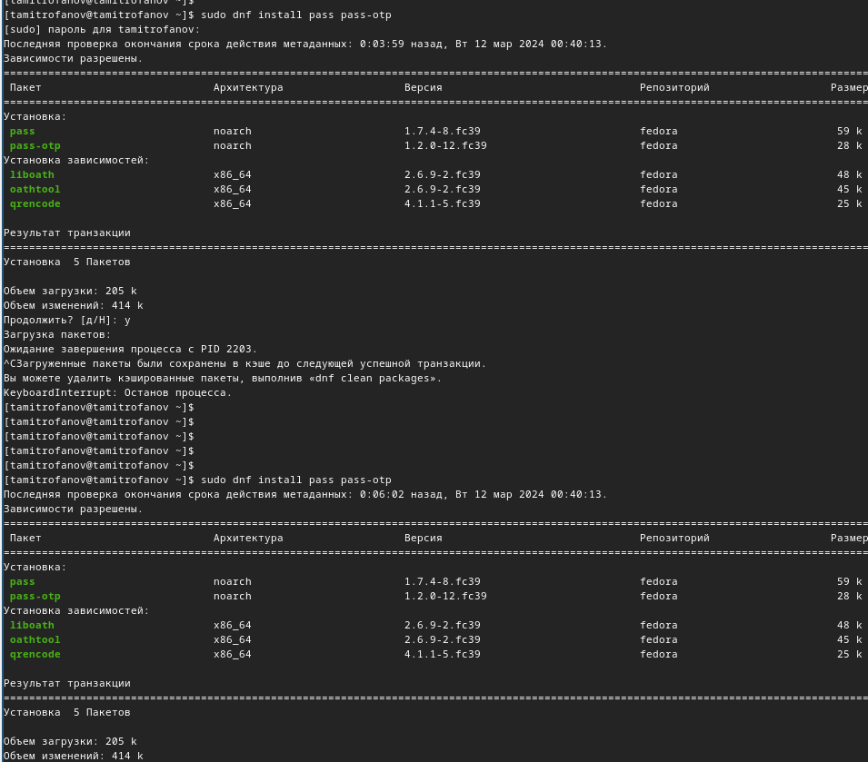{#fig:001 width=70%}

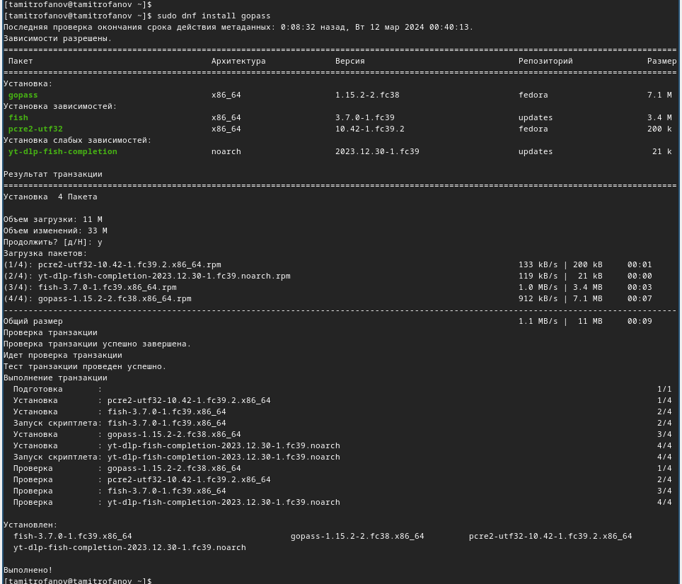{#fig:002 width=70%}

Просмотрим список ключей

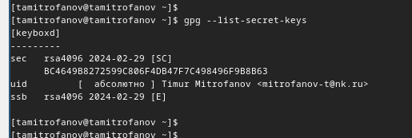{#fig:003 width=70%}

Инициализируем хранилище

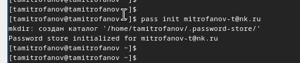{#fig:004 width=70%}

Создадим структуру git

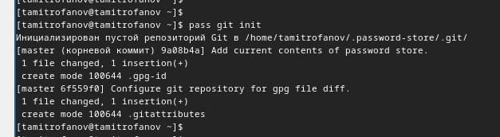{#fig:005 width=70%}

Созданим новый репозиторий pass

{#fig:006 width=70%}

Зададим адрес репозитория на хостинге

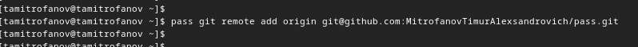{#fig:007 width=70%}

Для синхронизации выполним следующие команды

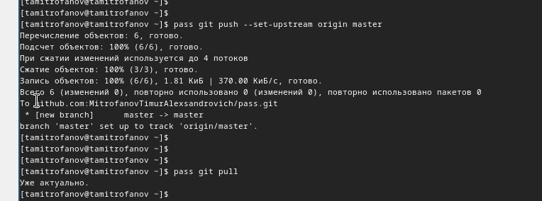{#fig:008 width=70%}

Проверим чтовсе данные синранизированы и нам нечего еомитить на сервер

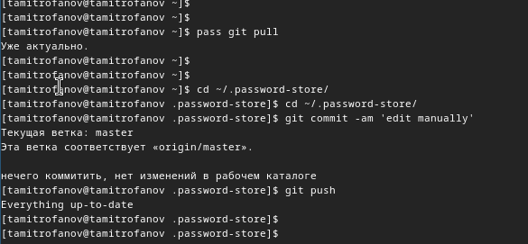{#fig:009 width=70%}

Также проверим статус синхронизации

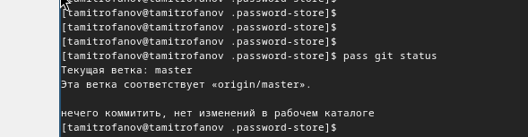{#fig:010 width=70%}

Для настройки работы с интерфейсом браузера добавим разрешения и установим соответствующие плагины

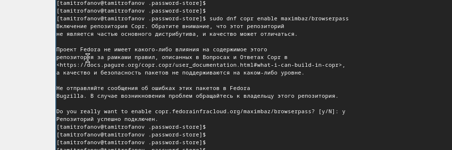{#fig:011 width=70%}

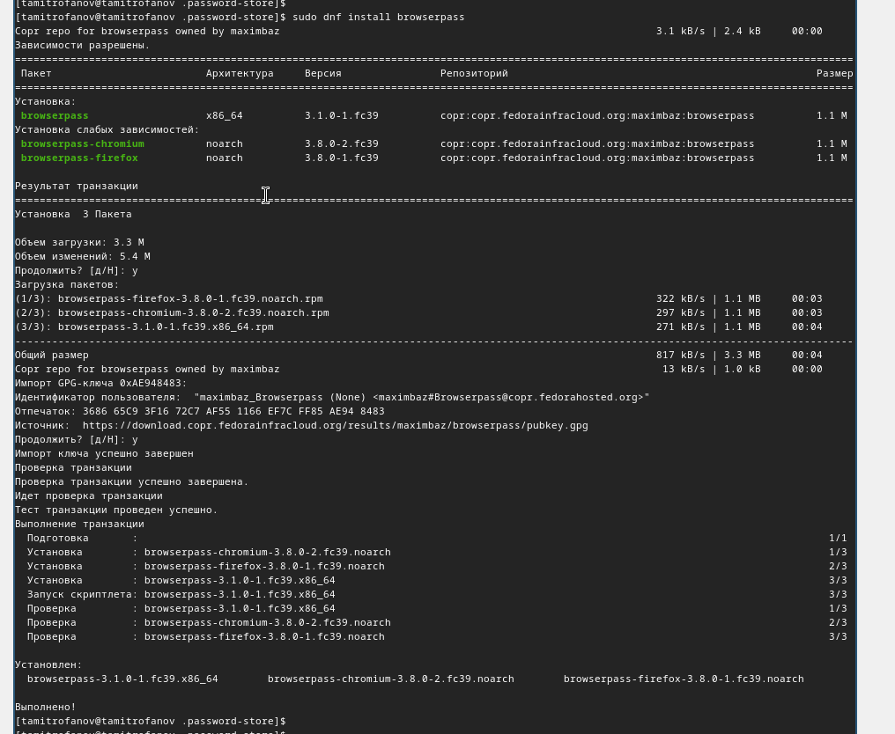{#fig:012 width=70%}

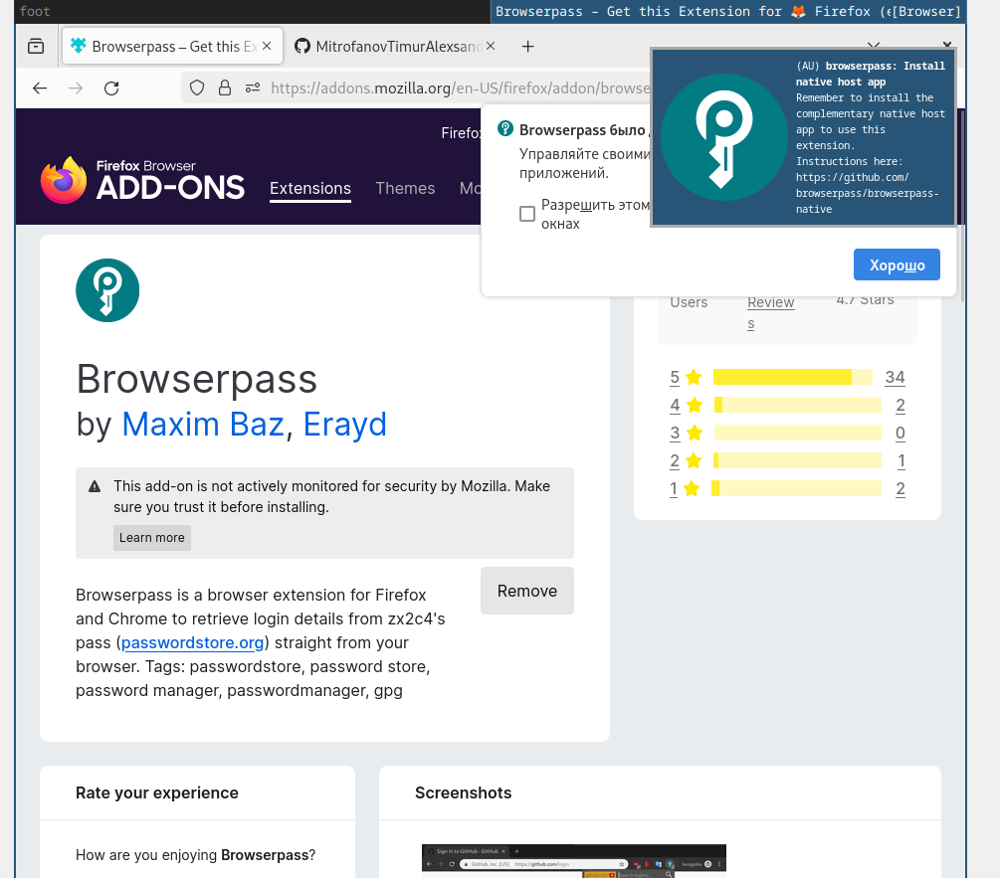{#fig:013 width=70%}

Создадим файл с поролями и запишем туда первый пароль

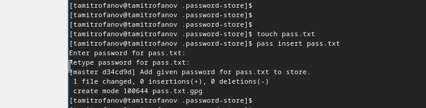{#fig:014 width=70%}

Проверим заданый пароль

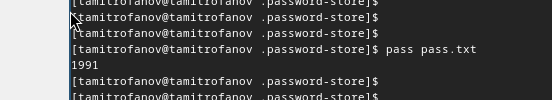{#fig:015 width=70%}

Сгенерируем новый пароль и запишем его в файл

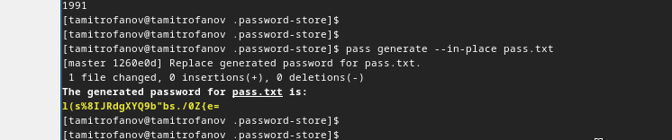{#fig:016 width=70%}

Установим доп. ПО для работами с файлами конфигурации

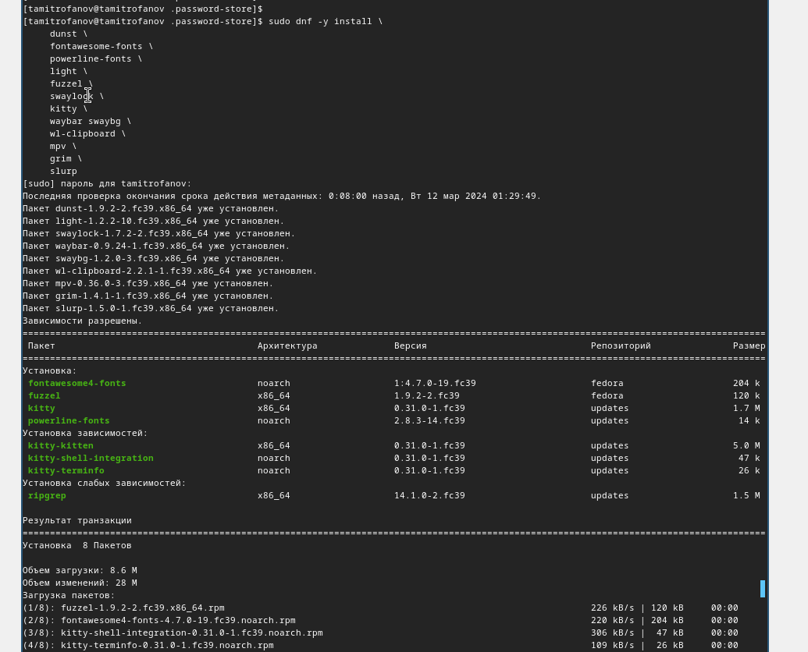{#fig:017 width=70%}

Установим шрифты

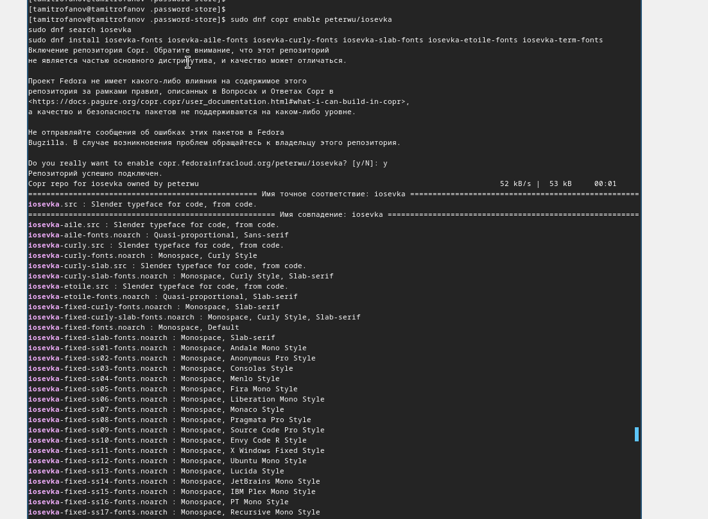{#fig:018 width=70%}

Установим бинарный файл

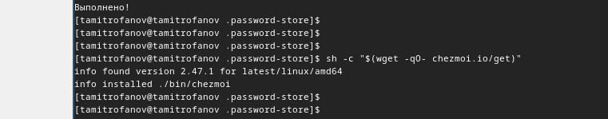{#fig:019 width=70%}

Создадим собственный репозиторий с помощью утилит

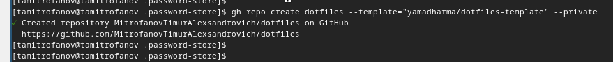{#fig:020 width=70%}

Инициализируем chezmoi с нашим репозиторием dotfiles

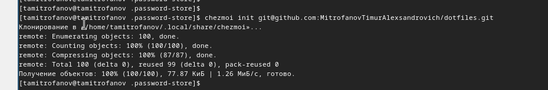{#fig:021 width=70%}

Проверим, какие изменения внесёт chezmoi в домашний каталог

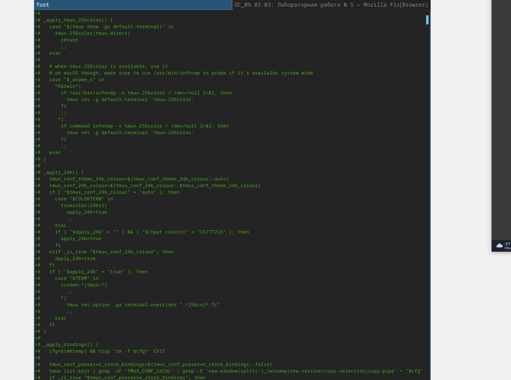{#fig:022 width=70%}

Нас устраивают изменения, внесённые chezmoi, запустим ***chezmoi apply -v***

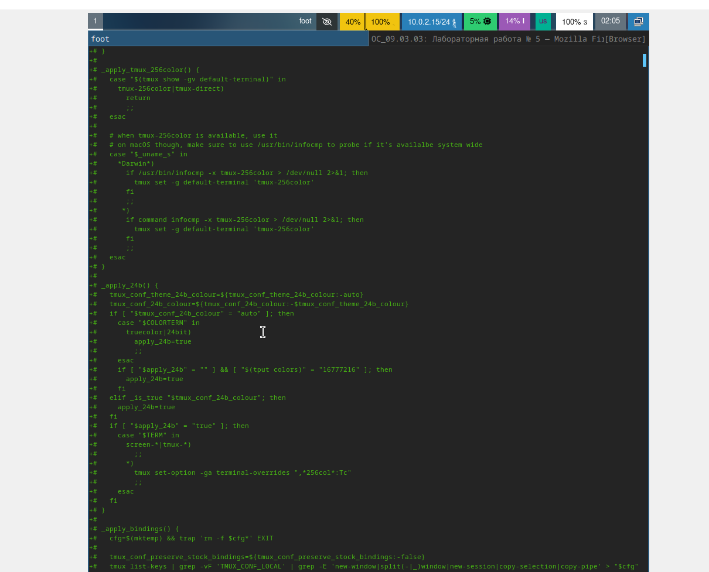{#fig:023 width=70%}

Установим chezmoi на второй вирт машине

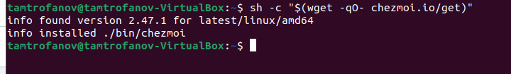{#fig:024 width=70%}

Инициализируем chezmoi с нашим репозиторием dotfiles

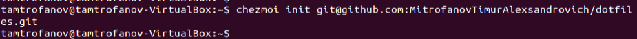{#fig:025 width=70%}

Проверим, какие изменения внесёт chezmoi в домашний каталог

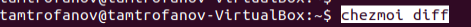{#fig:026 width=70%}

Нас устраивают изменения, внесённые chezmoi, запустим ***chezmoi apply -v***

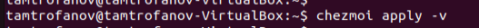{#fig:027 width=70%}

Извлечём последние изменения из репозитория и применим их

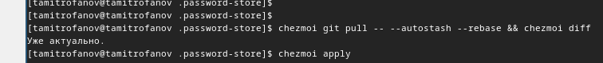{#fig:028 width=70%}

Включим автоматическую фиксацию изменений прописав соответствующие команды в файле ~/.config/chezmoi/chezmoi.toml

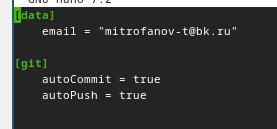{#fig:029 width=70%}

# Выводы

В этой лабораторной работе я Настроил рабочую среду для дальнейшей работы.

