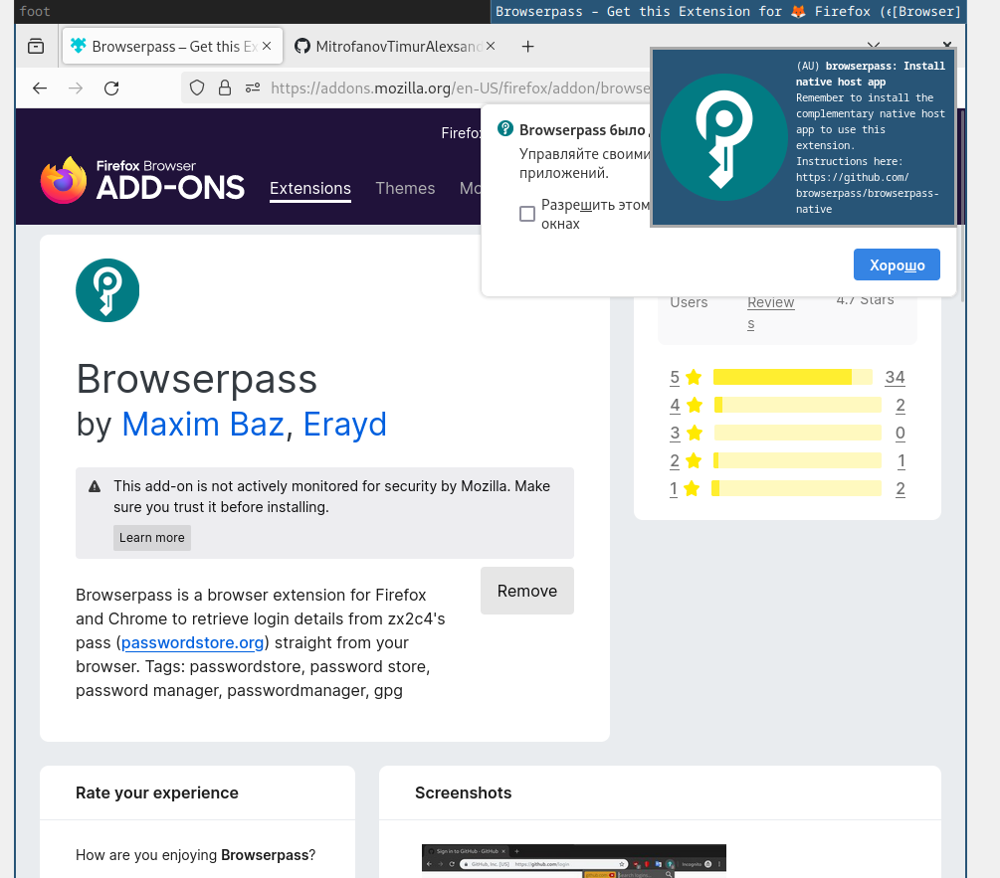

---
## Front matter
title: "Лабораторная работа №5"
subtitle: "Настройка рабочей среды."
author: "Митрофанов Тимур Александрович"

## Generic otions
lang: ru-RU
toc-title: "Содержание"

## Bibliography
bibliography: bib/cite.bib
csl: pandoc/csl/gost-r-7-0-5-2008-numeric.csl

## Pdf output format
toc: true # Table of contents
toc-depth: 2
lof: true # List of figures
fontsize: 12pt
linestretch: 1.5
papersize: a4
documentclass: scrreprt
## I18n polyglossia
polyglossia-lang:
  name: russian
  options:
	- spelling=modern
	- babelshorthands=true
polyglossia-otherlangs:
  name: english
## I18n babel
babel-lang: russian
babel-otherlangs: english
## Fonts
mainfont: PT Serif
romanfont: PT Serif
sansfont: PT Sans
monofont: PT Mono
mainfontoptions: Ligatures=TeX
romanfontoptions: Ligatures=TeX
sansfontoptions: Ligatures=TeX,Scale=MatchLowercase
monofontoptions: Scale=MatchLowercase,Scale=0.9
## Biblatex
biblatex: true
biblio-style: "gost-numeric"
biblatexoptions:
  - parentracker=true
  - backend=biber
  - hyperref=auto
  - language=auto
  - autolang=other*
  - citestyle=gost-numeric
## Pandoc-crossref LaTeX customization
figureTitle: "Рис."
tableTitle: "Таблица"
lofTitle: "Список иллюстраций"

## Misc options
indent: true
header-includes:
  - \usepackage{indentfirst}
  - \usepackage{float} # keep figures where there are in the text
  - \floatplacement{figure}{H} # keep figures where there are in the text
---

# Цель работы

Настройка рабочей среды для дальнейшей работы.

# Выполнение лабораторной работы

Устанавливаем менеджер паролей при помощи команд ***dnf install pass pass-otp*** и ***dnf install gopass***. (рис. [-@fig:001]) и (рис. [-@fig:002])

{#fig:001 width=70%}

{#fig:002 width=70%}

Просмотрим список ключей. (рис. [-@fig:003])

{#fig:003 width=70%}

Инициализируем хранилище. (рис. [-@fig:004])

{#fig:004 width=70%}

Создадим структуру git. (рис. [-@fig:005])

{#fig:005 width=70%}

Созданим новый репозиторий pass. (рис. [-@fig:006])

{#fig:006 width=70%}

Зададим адрес репозитория на хостинге. (рис. [-@fig:007])

{#fig:007 width=70%}

Для синхронизации выполним следующие команды. (рис. [-@fig:008])

{#fig:008 width=70%}

Проверим чтовсе данные синранизированы и нам нечего еомитить на сервер. (рис. [-@fig:009])

{#fig:009 width=70%}

Также проверим статус синхронизации. (рис. [-@fig:010])

{#fig:010 width=70%}

Для настройки работы с интерфейсом браузера добавим разрешения и установим соответствующие плагины. (рис. [-@fig:011]) и (рис. [-@fig:012]) и (рис. [-@fig:013])

{#fig:011 width=70%}

{#fig:012 width=70%}

{#fig:013 width=70%}

Создадим файл с поролями и запишем туда первый пароль. (рис. [-@fig:014])

{#fig:014 width=70%}

Проверим заданый пароль. (рис. [-@fig:015])

{#fig:015 width=70%}

Сгенерируем новый пароль и запишем его в файл. (рис. [-@fig:016])

{#fig:016 width=70%}

Установим доп. ПО для работами с файлами конфигурации. (рис. [-@fig:017])

{#fig:017 width=70%}

Установим шрифты. (рис. [-@fig:018])

{#fig:018 width=70%}

Установим бинарный файл. (рис. [-@fig:019])

{#fig:019 width=70%}

Создадим собственный репозиторий с помощью утилит. (рис. [-@fig:020])

{#fig:020 width=70%}

Инициализируем chezmoi с нашим репозиторием dotfiles. (рис. [-@fig:021])

{#fig:021 width=70%}

Проверим, какие изменения внесёт chezmoi в домашний каталог. (рис. [-@fig:022])

{#fig:022 width=70%}

Нас устраивают изменения, внесённые chezmoi, запустим ***chezmoi apply -v***. (рис. [-@fig:023])

{#fig:023 width=70%}

Установим chezmoi на второй вирт машине. (рис. [-@fig:024])

{#fig:024 width=70%}

Инициализируем chezmoi с нашим репозиторием dotfiles. (рис. [-@fig:025])

{#fig:025 width=70%}

Проверим, какие изменения внесёт chezmoi в домашний каталог. (рис. [-@fig:026])

{#fig:026 width=70%}

Нас устраивают изменения, внесённые chezmoi, запустим ***chezmoi apply -v***. (рис. [-@fig:027])

{#fig:027 width=70%}

Извлечём последние изменения из репозитория и применим их. (рис. [-@fig:028])

{#fig:028 width=70%}

Включим автоматическую фиксацию изменений прописав соответствующие команды в файле ~/.config/chezmoi/chezmoi.toml. (рис. [-@fig:029])

{#fig:029 width=70%}

# Выводы

В этой лабораторной работе я Настроил рабочую среду для дальнейшей работы.

