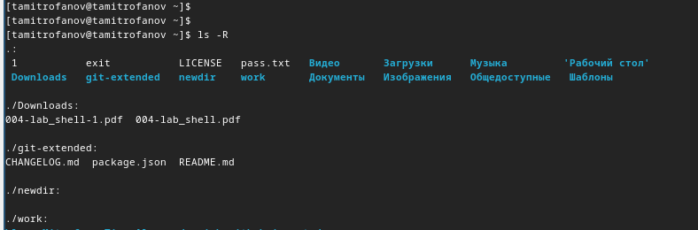

---
## Front matter
lang: ru-RU
title: "Лабораторная работа №6"
subtitle: "Основы интерфейса взаимодействия пользователся с ситемой Unix на уровне командной строки."
author:
  - Митрофанов Тимур Александрович
institute:
  - Российский университет дружбы народов, Москва, Россия
  
date: 02 марта 2024

## i18n babel
babel-lang: russian
babel-otherlangs: english

## Formatting pdf
toc: false
toc-title: Содержание
slide_level: 2
aspectratio: 169
section-titles: true
theme: metropolis
header-includes:
 - \metroset{progressbar=frametitle,sectionpage=progressbar,numbering=fraction}
 - '\makeatletter'
 - '\beamer@ignorenonframefalse'
 - '\makeatother'
 
## Fonts
mainfont: PT Serif
romanfont: PT Serif
sansfont: PT Sans
monofont: PT Mono
mainfontoptions: Ligatures=TeX
romanfontoptions: Ligatures=TeX
sansfontoptions: Ligatures=TeX,Scale=MatchLowercase
monofontoptions: Scale=MatchLowercase,Scale=0.9

---

# Информация

## Докладчик

:::::::::::::: {.columns align=center}
::: {.column width="70%"}

  * Митрофанов Тимур Александрович
  * Студент 1 курса
  * Российский университет дружбы народов
  * [1132231842@pfur.ru](1132231842@pfur.ru)

:::
::: {.column width="30%"}


:::
::::::::::::::


# Цель работы

Приобретение практических навыков взаимодействия пользователя с системой посредством командной строки.


# Выполнение лабораторной работы

Выведем полный путь в наш домашний репозиторий

{#fig:001 width=70%}

##

Перейдём в tmp

{#fig:002 width=70%}

##

Вывод файлов в tmp при помощи команды ***ls***

{#fig:003 width=70%}

##

Вывод файлов(и скрытых тоже) в tmp при помощи команды ***ls -a***

{#fig:004 width=70%}

##

Вывод файлов с подробной информацией о них в tmp при помощи команды ***ls -l***

{#fig:005 width=70%}

##

Вывод файлов с указанием их типа в tmp при помощи команды ***ls -F***

{#fig:006 width=70%}

##

Вывод всех файлов tmp с казанием всей информацией о них

{#fig:007 width=70%}

##

Убедились что в var/spool есть cron

{#fig:008 width=70%}

##

При помощи команды ***ls -tl*** выводим файлы отсортированные по дате изменения
 
{#fig:009 width=70%}

##
 
Созданим новую папку

{#fig:010 width=70%}

##

Создадим ещё одну папку в уже создоной папки не находясь в ней

{#fig:011 width=70%}

##

Создадим сразу 3 папки одной командой

{#fig:012 width=70%}

##

Удалим сразу 3 папки одной командой

{#fig:013 width=70%}

##

При попытке удалить папку командой ***rm*** возвращается ошибка так как rm предназначена для удаления фалов а не папок

{#fig:014 width=70%}

##

Удалим ранее созданую папку не переходя в место её расположения

{#fig:015 width=70%}

##

При помощи команды ***man ls*** можно прочитать документацию к команде ***ls***

{#fig:016 width=70%}

##

Выведем данные о файлах в дериктории с рекурсивным указанием файлов в файлах

{#fig:017 width=70%}

##

При помощи команды ***ls -tl*** выводим файлы отсортированные по дате изменения
 
{#fig:018 width=70%}

##
 
Прочитаем документацию по основным командам

{#fig:019 width=70%}

## Контрольные вопросы

##
1. Командная строка — это интерфейс взаимодействия с операционной системой, который позволяет пользователю вводить команды для выполнения различных операций, таких как управление файлами и каталогами, запуск программ, настройка системы и т.д.

##
2. Для определения абсолютного пути текущего каталога можно использовать команду `pwd` (print working directory). Например:
   ```
   $ pwd
   /home/user/documents
   ```

##

3. Для определения только типов файлов и их имен в текущем каталоге можно использовать команду `ls` с опцией `-F` (добавляет символы, указывающие тип файла) и опцией `--classify` (классифицирует вывод). Пример:
   ```
   $ ls -F
   file1.txt  folder1/  executable*
   ```

##

4. Для отображения информации о скрытых файлах можно использовать опцию `-a` с командой `ls`. Пример:
   ```
   $ ls -a
   .  ..  .hiddenfile  file1.txt
   ```

##

5. Для удаления файлов используется команда `rm`, а для удаления каталогов — команда `rmdir`. Удаление файлов и каталогов одной командой не предусмотрено. Примеры:
   ```
   $ rm file.txt
   $ rmdir folder
   ```

##

6. Для вывода информации о последних выполненных пользователем командах можно использовать историю команд. Например, в большинстве оболочек Unix/Linux можно просто нажать клавишу вверх на клавиатуре, чтобы просмотреть предыдущие команды.

##

7. Для модифицированного выполнения команды из истории можно использовать сочетание клавиш Ctrl+R и начать вводить часть команды, которую нужно найти в истории. Пример: нажатие Ctrl+R, затем ввод "ls", чтобы найти последнюю команду, начинающуюся с "ls".

##

8. Примеры запуска нескольких команд в одной строке:
   ```
   $ command1 ; command2
   $ command1 && command2
   $ command1 || command2
   ```

##

9. Символ экранирования (\) используется для обозначения специального значения символа. Например, `\n` обозначает символ новой строки, а `\$` обозначает символ доллара как обычный символ, а не переменную оболочки.

##

10. Вывод информации на экран после выполнения команды `ls -l` содержит детальную информацию о файлах и каталогах, включая разрешения доступа, количество ссылок, владельца, группу, размер файла в байтах, дату и время последнего изменения и имя файла. Каждая строка представляет отдельный файл или каталог.

##

11. Относительный путь к файлу — это путь, который указывает на файл относительно текущего каталога. Например, если текущий каталог `/home/user/`, то относительный путь к файлу `document.txt` в подкаталоге `documents` будет `documents/document.txt`.

##

12. Для получения информации о команде можно использовать команду `man` с названием команды. Например:
    ```
    $ man ls
    ```

##

13. Для автоматического дополнения вводимых команд можно использовать клавишу Tab. Например, если ввести начало имени файла или команды, затем нажать Tab, система автоматически дополнит название файла или команды, если это возможно.

# Выводы

В этой лабораторной работе я приобрёл практические навыки взаимодействия пользователя с системой посредством командной строки.


