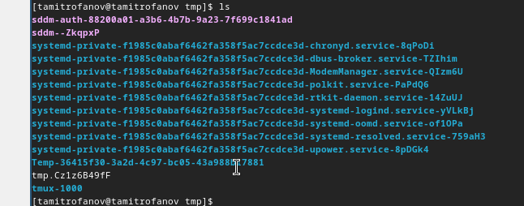
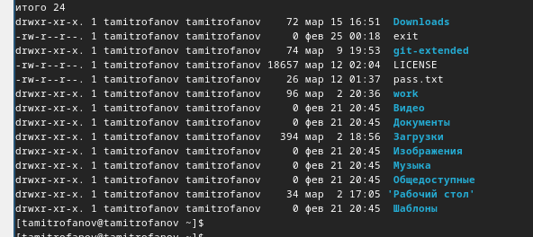
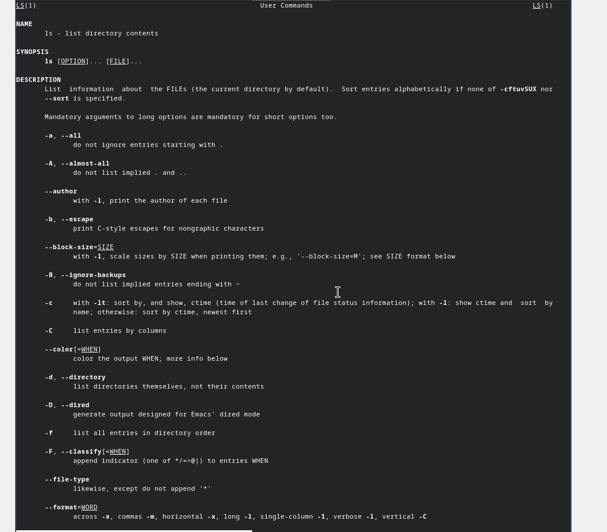
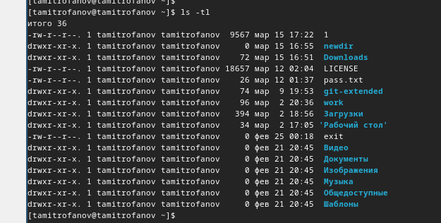

---
## Front matter
title: "Лабораторная работа №6"
subtitle: "Основы интерфейса взаимодействия пользователся с ситемой Unix на уровне командной строки."
author: "Митрофанов Тимур Александрович"

## Generic otions
lang: ru-RU
toc-title: "Содержание"

## Bibliography
bibliography: bib/cite.bib
csl: pandoc/csl/gost-r-7-0-5-2008-numeric.csl

## Pdf output format
toc: true # Table of contents
toc-depth: 2
lof: true # List of figures
fontsize: 12pt
linestretch: 1.5
papersize: a4
documentclass: scrreprt
## I18n polyglossia
polyglossia-lang:
  name: russian
  options:
	- spelling=modern
	- babelshorthands=true
polyglossia-otherlangs:
  name: english
## I18n babel
babel-lang: russian
babel-otherlangs: english
## Fonts
mainfont: PT Serif
romanfont: PT Serif
sansfont: PT Sans
monofont: PT Mono
mainfontoptions: Ligatures=TeX
romanfontoptions: Ligatures=TeX
sansfontoptions: Ligatures=TeX,Scale=MatchLowercase
monofontoptions: Scale=MatchLowercase,Scale=0.9
## Biblatex
biblatex: true
biblio-style: "gost-numeric"
biblatexoptions:
  - parentracker=true
  - backend=biber
  - hyperref=auto
  - language=auto
  - autolang=other*
  - citestyle=gost-numeric
## Pandoc-crossref LaTeX customization
figureTitle: "Рис."
tableTitle: "Таблица"
lofTitle: "Список иллюстраций"

## Misc options
indent: true
header-includes:
  - \usepackage{indentfirst}
  - \usepackage{float} # keep figures where there are in the text
  - \floatplacement{figure}{H} # keep figures where there are in the text
---

# Цель работы

Приобретение практических навыков взаимодействия пользователя с системой посредством командной строки.


# Выполнение лабораторной работы

Выведем полный путь в наш домашний репозиторий. (рис. [-@fig:001])

{#fig:001 width=70%}

Перейдём в tmp. (рис. [-@fig:002])

{#fig:002 width=70%}

Вывод файлов в tmp при помощи команды ***ls***. (рис. [-@fig:003])

{#fig:003 width=70%}

Вывод файлов(и скрытых тоже) в tmp при помощи команды ***ls -a***. (рис. [-@fig:004])

{#fig:004 width=70%}

Вывод файлов с подробной информацией о них в tmp при помощи команды ***ls -l***. (рис. [-@fig:005])

{#fig:005 width=70%}

Вывод файлов с указанием их типа в tmp при помощи команды ***ls -F***. (рис. [-@fig:006])

{#fig:006 width=70%}

Вывод всех файлов tmp с казанием всей информацией о них. (рис. [-@fig:007])

{#fig:007 width=70%}

Убедились что в var/spool есть cron. (рис. [-@fig:008])

{#fig:008 width=70%}

При помощи команды ***ls -tl*** выводим файлы отсортированные по дате изменения. (рис. [-@fig:009])
 
{#fig:009 width=70%}
 
Созданим новую папку. (рис. [-@fig:010])

{#fig:010 width=70%}

Создадим ещё одну папку в уже создоной папки не находясь в ней. (рис. [-@fig:011])

{#fig:011 width=70%}

Создадим сразу 3 папки одной командой. (рис. [-@fig:012])

{#fig:012 width=70%}

Удалим сразу 3 папки одной командой. (рис. [-@fig:013])

{#fig:013 width=70%}

При попытке удалить папку командой ***rm*** возвращается ошибка так как rm предназначена для удаления фалов а не папок. (рис. [-@fig:014])

{#fig:014 width=70%}

Удалим ранее созданую папку не переходя в место её расположения. (рис. [-@fig:015])

{#fig:015 width=70%}

При помощи команды ***man ls*** можно прочитать документацию к команде ***ls***. (рис. [-@fig:016])

{#fig:016 width=70%}

Выведем данные о файлах в дериктории с рекурсивным указанием файлов в файлах. (рис. [-@fig:017])

{#fig:017 width=70%}

При помощи команды ***ls -tl*** выводим файлы отсортированные по дате изменения. (рис. [-@fig:018])
 
{#fig:018 width=70%}
 
Прочитаем документацию по основным командам. (рис. [-@fig:019])

{#fig:019 width=70%}

# Контрольные вопросы

1. Командная строка — это интерфейс взаимодействия с операционной системой, который позволяет пользователю вводить команды для выполнения различных операций, таких как управление файлами и каталогами, запуск программ, настройка системы и т.д.

2. Для определения абсолютного пути текущего каталога можно использовать команду `pwd` (print working directory). Например:
   ```
   $ pwd
   /home/user/documents
   ```

3. Для определения только типов файлов и их имен в текущем каталоге можно использовать команду `ls` с опцией `-F` (добавляет символы, указывающие тип файла) и опцией `--classify` (классифицирует вывод). Пример:
   ```
   $ ls -F
   file1.txt  folder1/  executable*
   ```

4. Для отображения информации о скрытых файлах можно использовать опцию `-a` с командой `ls`. Пример:
   ```
   $ ls -a
   .  ..  .hiddenfile  file1.txt
   ```

5. Для удаления файлов используется команда `rm`, а для удаления каталогов — команда `rmdir`. Удаление файлов и каталогов одной командой не предусмотрено. Примеры:
   ```
   $ rm file.txt
   $ rmdir folder
   ```

6. Для вывода информации о последних выполненных пользователем командах можно использовать историю команд. Например, в большинстве оболочек Unix/Linux можно просто нажать клавишу вверх на клавиатуре, чтобы просмотреть предыдущие команды.

7. Для модифицированного выполнения команды из истории можно использовать сочетание клавиш Ctrl+R и начать вводить часть команды, которую нужно найти в истории. Пример: нажатие Ctrl+R, затем ввод "ls", чтобы найти последнюю команду, начинающуюся с "ls".

8. Примеры запуска нескольких команд в одной строке:
   ```
   $ command1 ; command2
   $ command1 && command2
   $ command1 || command2
   ```

9. Символ экранирования (\) используется для обозначения специального значения символа. Например, `\n` обозначает символ новой строки, а `\$` обозначает символ доллара как обычный символ, а не переменную оболочки.

10. Вывод информации на экран после выполнения команды `ls -l` содержит детальную информацию о файлах и каталогах, включая разрешения доступа, количество ссылок, владельца, группу, размер файла в байтах, дату и время последнего изменения и имя файла. Каждая строка представляет отдельный файл или каталог.

11. Относительный путь к файлу — это путь, который указывает на файл относительно текущего каталога. Например, если текущий каталог `/home/user/`, то относительный путь к файлу `document.txt` в подкаталоге `documents` будет `documents/document.txt`.

12. Для получения информации о команде можно использовать команду `man` с названием команды. Например:
    ```
    $ man ls
    ```

13. Для автоматического дополнения вводимых команд можно использовать клавишу Tab. Например, если ввести начало имени файла или команды, затем нажать Tab, система автоматически дополнит название файла или команды, если это возможно.

# Выводы

В этой лабораторной работе я приобрёл практические навыки взаимодействия пользователя с системой посредством командной строки.

