---
## Front matter
title: "Лабораторная работа №7"
subtitle: "Операционные системы"
author: "Митрофанов Тимур Александрович"

## Generic otions
lang: ru-RU
toc-title: "Содержание"

## Bibliography
bibliography: bib/cite.bib
csl: pandoc/csl/gost-r-7-0-5-2008-numeric.csl

## Pdf output format
toc: true # Table of contents
toc-depth: 2
lof: true # List of figures
fontsize: 12pt
linestretch: 1.5
papersize: a4
documentclass: scrreprt
## I18n polyglossia
polyglossia-lang:
  name: russian
  options:
	- spelling=modern
	- babelshorthands=true
polyglossia-otherlangs:
  name: english
## I18n babel
babel-lang: russian
babel-otherlangs: english
## Fonts
mainfont: PT Serif
romanfont: PT Serif
sansfont: PT Sans
monofont: PT Mono
mainfontoptions: Ligatures=TeX
romanfontoptions: Ligatures=TeX
sansfontoptions: Ligatures=TeX,Scale=MatchLowercase
monofontoptions: Scale=MatchLowercase,Scale=0.9
## Biblatex
biblatex: true
biblio-style: "gost-numeric"
biblatexoptions:
  - parentracker=true
  - backend=biber
  - hyperref=auto
  - language=auto
  - autolang=other*
  - citestyle=gost-numeric
## Pandoc-crossref LaTeX customization
figureTitle: "Рис."
tableTitle: "Таблица"
listingTitle: "Листинг"
lofTitle: "Список иллюстраций"
lolTitle: "Листинги"
## Misc options
indent: true
header-includes:
  - \usepackage{indentfirst}
  - \usepackage{float} # keep figures where there are in the text
  - \floatplacement{figure}{H} # keep figures where there are in the text
---

# Цель работы

Целью данной лабораторной работы является ознакомление с файловой системой Linux, её структурой, именами и содержанием каталогов. Приобретение практических навыков по применению команд для работы с файлами и каталогами, по управлению процессами (и работами), по проверке использования диска и обслуживанию файловой системы.

# Выполнение лабораторной работы

Копируем файл ~/abc1 в фaйл april и файл may. (рис. [-@fig:001]).

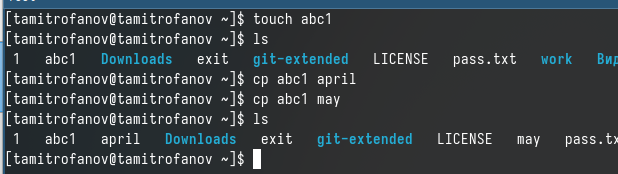{#fig:001 width=70%}

Копируем файлы april и may в каталог monthly. (рис. [-@fig:002]).

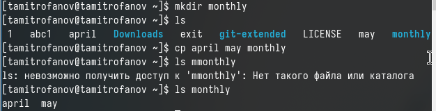{#fig:002 width=70%}

Копируем файл monthly/may в файл june. С помощью утилиты ls мы видим, что файл был удачно скопирован. (рис. [-@fig:003]).

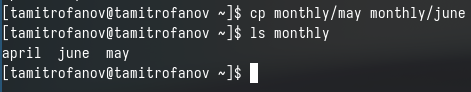{#fig:003 width=70%}

Копируем каталог monthly в новый каталог monthly.00, с помощью утилиты ls видим, что все скопировано. (рис. [-@fig:004]).

{#fig:004 width=70%}

Копируем каталог monthly.00 в каталог /tmp. С помощью ls мы видим, что каталог monthly.00 теперь находиться и в tmp (рис. [-@fig:005]).

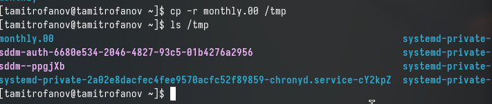{#fig:005 width=70%}

Изменяем название файла april на july в домашнем каталоге, с утилитой ls проверяем, что все удачно выполнилось. (рис. [-@fig:006]).

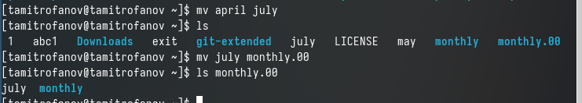{#fig:006 width=70%}

Перемещаем файл july в каталог monthly.00, с помощью ls проверяем. (рис. [-@fig:007]).

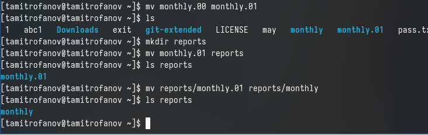{#fig:007 width=70%}

Переименовываем каталог monthly.00 в monthly.01. Затем перемещаем каталог monthly.01 в новый каталог reports. Далее переименовываем каталог report/monthly.01 в reports/monthly. (рис. [-@fig:008]).

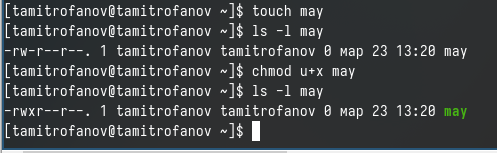{#fig:008 width=70%}

Создаём файл may и устанавливаю для него права выполнения для владельца, с помощью команды ls и утилита l, видим, что права доступа изменились. (рис. [-@fig:009]).

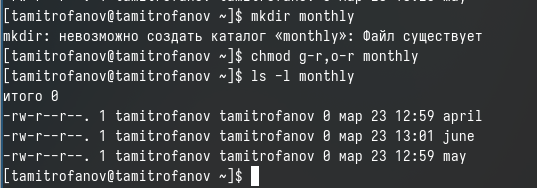{#fig:009 width=70%}

Лишаем владельца may права на выполнение.  (рис. [-@fig:010]).

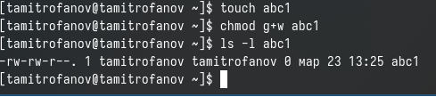{#fig:010 width=70%}

Создаём каталог monthly, и устанавливаем права доступа как запрет на чтение для членов группы и всех остальных пользователей. (рис. [-@fig:011]).

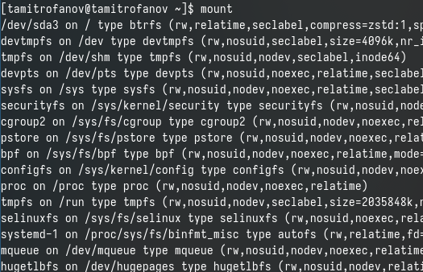{#fig:011 width=70%}

Создаём новый файл abc1 с правом для членов группы. (рис. [-@fig:012]).

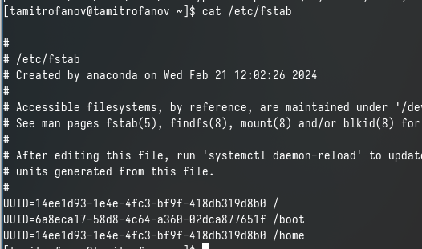{#fig:012 width=70%}

Для просмотра используемых в операционной системе файловых систем используем команду mount без параментров. (рис. [-@fig:001]).

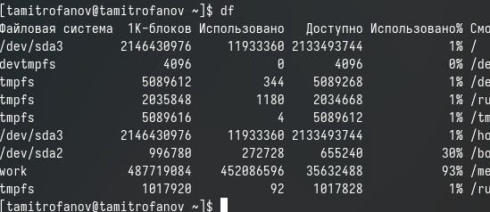{#fig:013 width=70%}

С помощью утилиты cat просматриваем содержания файла /etc/fstab. (рис. [-@fig:014]).

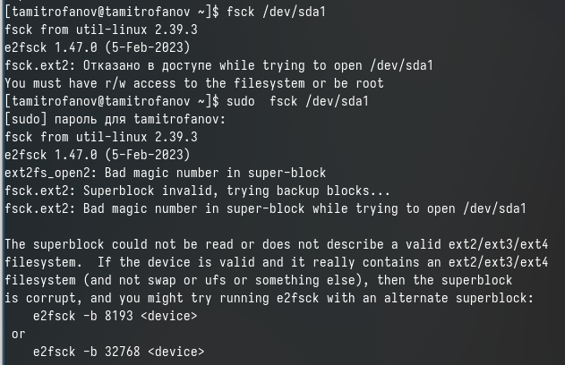{#fig:014 width=70%} 

Используем команду df  и определяю объем свободного пространства на файловой системе. (рис. [-@fig:015]).

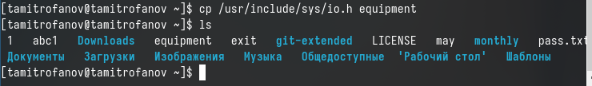{#fig:015 width=70%}

С помощью fsck проверяем целостность файловой системы. (рис. [-@fig:016]).

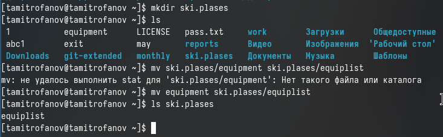{#fig:016 width=70%}

Копируем файл /usr/include/sys/io.h в домашний каталог и называем его equipment. (рис. [-@fig:017]).

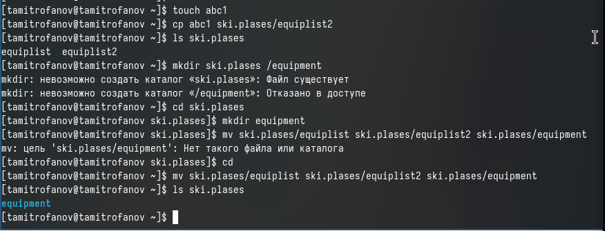{#fig:017 width=70%}

В домашнем каталоге создаём директорию ~/ski.plases. Перемещаем файл equipment в каталоге ~/ski.plases. Затем переименовываем файл ~/ski.pases/equiment в ~/ski.plases/equilist. C помощью утилиты ls проверяем, что файлы переммещены и  переименованы. (рис. [-@fig:018]).

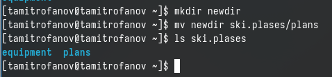{#fig:018 width=70%} 

Создаём в домашнем каталоге файл abc1 и копируем его в каталог ~/ski.plases, назовём его equiplist2. Затем создаём каталог с именем equipment в каталоге ~/ski.plases. Далее перемещаем файлы с ski.plases  в каталог ski.plases/equipment. (рис. [-@fig:019]).

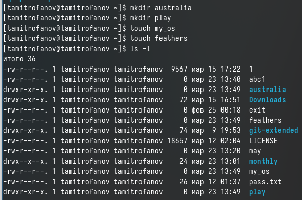{#fig:019 width=70%} 

Создаём новый каталог newdir и перемещаем его в старый каталог ski.plases, поменяв название на plans. (рис. [-@fig:020]).

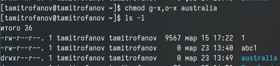{#fig:020 width=70%}

Для начала необходимо создать все каталоги и файлы над которыми я буду работать. (рис. [-@fig:021]).

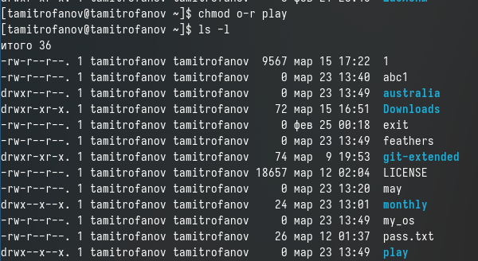{#fig:021 width=70%}

Проверяем какие  права доступа у этих файлов и каталогов имеюся на данны момент. (рис. [-@fig:022]).

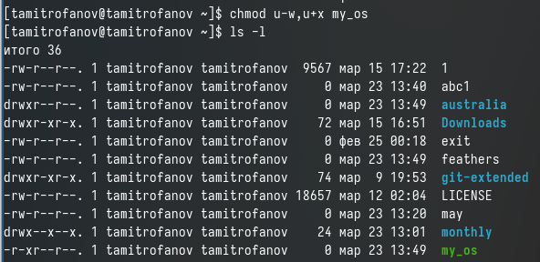{#fig:022 width=70%}

В каталоге australia нужно лишить права на выполнения у группы, в которую входит владелец и во всех остальных, чтобы у нового каталога были нужные по заданию права доступа. С помощью команды ls -l мы видим, что права доступа были правильно отредактированы. (рис. [-@fig:023]).

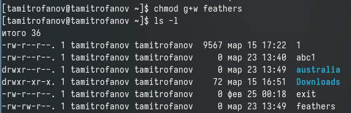{#fig:023 width=70%}

В каталоге play нужно лишить права на чтение у всех остальных и у группы, в которую входит владелец,чтобы у ногово каталога были нужные по заданию права доступа. С помощью команды ls -l мы видим, что права доступа были правильно отредактированы.(рис. [-@fig:024] и рис. [-@fig:025]).

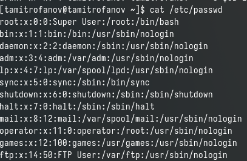{#fig:024 width=70%}

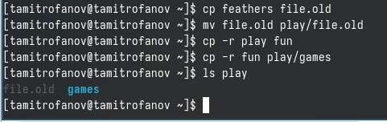{#fig:025 width=70%}

В файле my_os нужно лишить права на письмо и добавить права на выполнение владельцу,чтобы у ногово каталога были нужные по заданию права доступа. С помощью команды ls -l мы видим, что права доступа были правильно отредактированы.(рис. [-@fig:026]). 

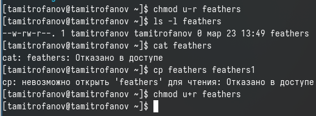{#fig:026 width=70%}

В файле feathers необходимо добавить права на письмо группе, к которому пренадлежит владелец,чтобы у ногово каталога были нужные по заданию права доступа. С помощью команды ls -l мы видим, что права доступа были правильно отредактированы.(рис. [-@fig:027]).

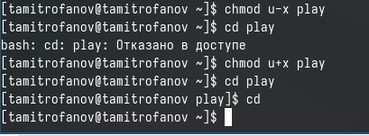{#fig:027 width=70%}

С помощью команды cat просматриваю содержение файла /etc/passwd. (рис. [-@fig:028]).

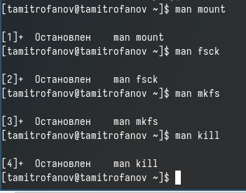{#fig:028 width=70%}

Копируем файл feathers в фвйл file.old.В свою очередь файл file.old  перемещаем в каталог play.В свою очередь каталог play  копируем в каталог fun. Затем перемещаем каталог fun в  каталог play  и переименовываем его в games. C помощью команды ls, проверяем содержание каталога play и видим, что теперь в нем находятся файл file.old и каталог games. (рис. [-@fig:029]).

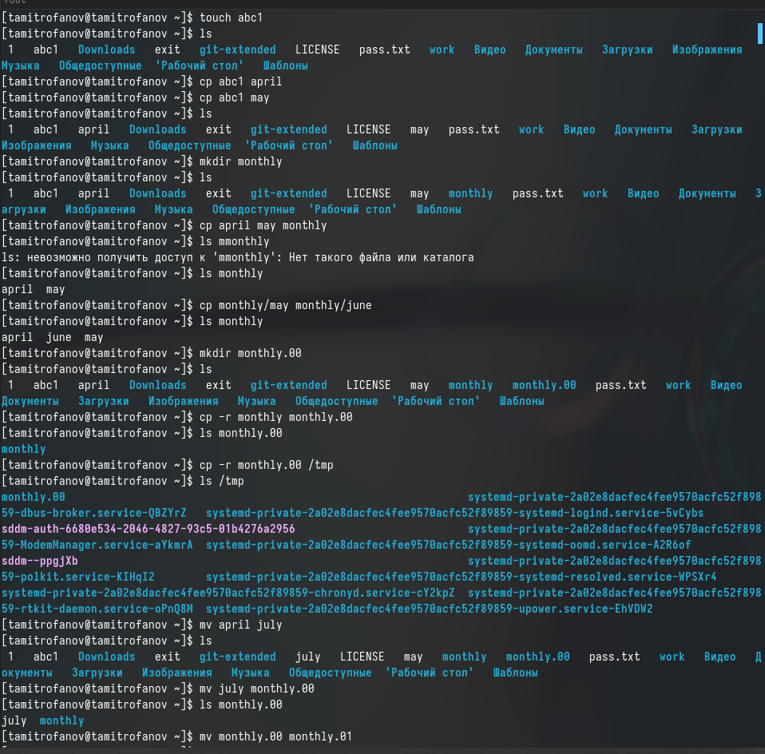{#fig:029 width=70%}

Лишаем владельца файла feathers права на чтение. (рис. [-@fig:030]).

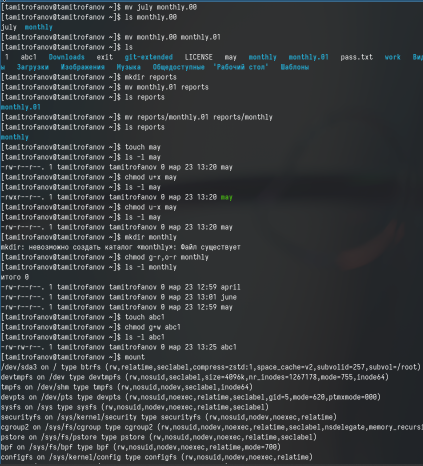{#fig:030 width=70%}

Лишаем владельца каталога play права на выполнение. Добавляем права на чтение владельцу.(рис. [-@fig:031]).

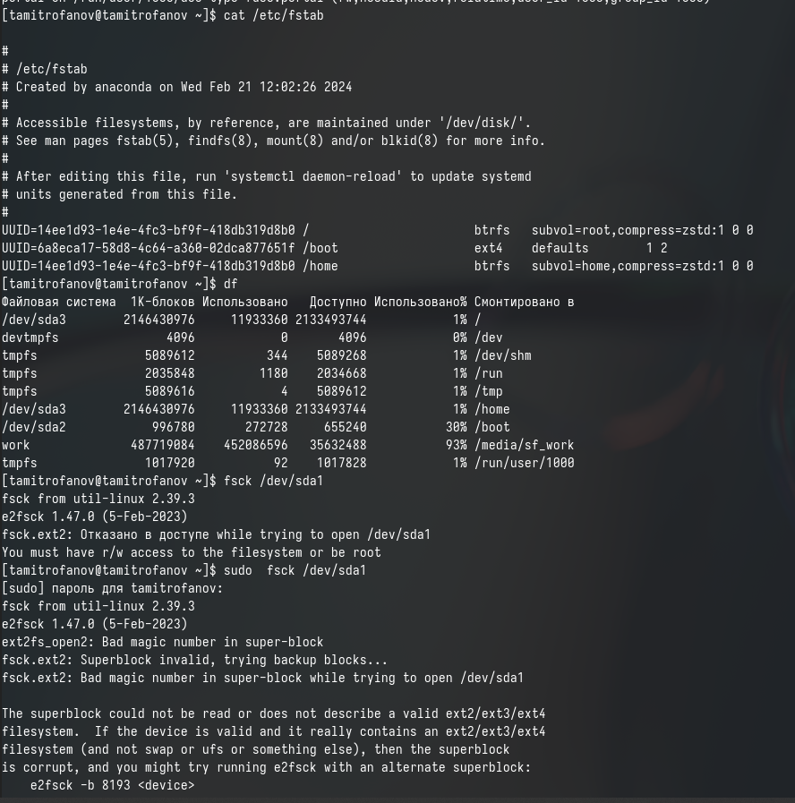{#fig:031 width=70%}

## Ответы на контрольные вопросы ##

1. NTFS — стандартная файловая система для семейства операционных систем Windows NT фирмы Microsoft.\

Особенности NTFS:\
- Поддерживает хранение метаданных.\
- Для улучшения производительности, надёжности и эффективности использования дискового пространства в NTFS используются специализированные структуры данных. \
- Информация о файлах хранится в главной файловой таблице — Master File Table (MFT). \
- Поддерживает разграничение доступа к данным для различных пользователей и групп пользователей. \
- Позволяет назначать дисковые квоты. \
- Для повышения надёжности файловой системы в NTFS используется система журналирования USN. \ 
- Размер кластера по умолчанию составляет от 512 байт до 2 МБ в зависимости от размера тома и версии ОС. \

2. Файловая система NTFS (New Technology File) используется в операционной системе Windows.\ 

- Volume Boot Record (VBR): это область, содержащая информацию о файловой системе и код, необходимый для начальной загрузки операционной системы. \
Master File Table (MFT): MFT – это центральная таблица файловой системы NTFS, в которой хранится метаданные (информация о файле или папке) для всех файлов и папок на диске. \
$MFTMirr: зеркало MFT хранит копию первичной MFT, обеспечивая доступ к метаданным в случае повреждения MFT. \
$LogFile: файл журнала (Log File) содержит информацию о транзакциях файловой системы и используется для восстановления при сбоях. \
$Volume:этот файл содержит информацию о том, включая метку тома, серийный номер и другие свойства тома. \
$AttrDef: этот файл содержит описание атрибутов файлов и папок, определяющих их свойства и метаданные. \
$Root:корневой каталог, представляющий корневой каталог диска. \
$Bitmap: Bitmap (битовая карта) используется для отслеживания использования кластеров на диске - каждый бит представляет собой класстер. \
$Boot: этот файл содержит загрузочный код, необходимый для загрузки операционной системы с данного тома. \

3. В Linux, операция монтирования выполняется с помощью команды mount. Эта команда принимает информацию о файловой системе, которую необходимо примонтировать, а также путь к точке монтирования, и затем привязывает содержимое файловой системы к указанной точке монтирования.

4. Причин, по которой могут произойти наркшение целосности файловой системы, много. Наприме: сбой в работе системы или аппаратный сбой, вирусы и вредоносное ПО, физические повреждения диска, неправильные опреции пользователя. С помощью команды fsck можно проверить (а в ряде случаев восстановить) целостность файловой системы.

5. Файловая система создается с помощью команды mkfs.

6. cat: Команда cat (от “concatenate”) показывает содержимое текстового файла прямо в командной строке. Она также позволяет объединять содержимое нескольких файлов. \
more: Команда more показывает содержимое файла постранично, останавливаясь на каждой странице и ожидая нажатия клавиши для продолжения. \
less: Команда less подобна команде more, но предоставляет больше возможностей для прокрутки вперед и назад по содержимому файла. \
head: Команда head выводит начальные строки (по умолчанию, первые 10 строк) из текстового файла. \
tail: Команда tail выводит конечные строки (по умолчанию, последние 10 строк) из текстового файла. Она также может использоваться для непрерывного отслеживания добавления данных в файл.

7. Команда cp в Linux используется для копирования файлов и директорий, cp -r это рекурсивное копирование содержимого каталога.

8. Команда mv в Linux используется для перемещения файлов и директорий из одного места в другое, а также переименование файлов и каталогов.

9. Права доступа (permissions) вационных системх, таких как Linux, представют собой механизмроля доступа к файлам и директориям. Они опеляют, какели и группы могут взаимодействовать с конкретными ресурсами. В Unix-подобных системах (таких как Linux), права доступа обычно представлены в виде трех различных аспектов: прав для владельца файла, прав для группы и прав для других пользователей.

Каждый файл или директория имеет набор прав доступа, который состоит из комбинации трех основных видов доступа: чтение (read), запись (write) и выполнение (execute). Эти права также могут быть установлены для владельца файла, группы и других пользователей. Комбинация этих прав создает универсальную систему контроля доступа, позволяющую определить, кто может выполнять какие операции с определенными файлами.

В Linux права доступа могут быть изменены с использованием команды chmod.

# Выводы

Сегодня я знакомился с файловой системой Linux, её структурой, именами и содержанием каталогов. Приобрёл практические навыки по применению команд для работы с файлами и каталогами, по управлению процессами (и работами), по проверке использования диска и обслуживанию файловой системы.

