---
## Front matter
lang: ru-RU
title: "Презентация о выполнении. Индивидуальный проект."
subtitle: "Этап 1"
author:
  - "Митрофанов Тимур Александрович"
institute:
  - Российский университет дружбы народов, Москва, Россия

date: 02 марта 2024

## i18n babel
babel-lang: russian
babel-otherlangs: english

## Formatting pdf
toc: false
toc-title: Содержание
slide_level: 2
aspectratio: 169
section-titles: true
theme: metropolis
header-includes:
 - \metroset{progressbar=frametitle,sectionpage=progressbar,numbering=fraction}
 - '\makeatletter'
 - '\beamer@ignorenonframefalse'
 - '\makeatother'
 ## Fonts
mainfont: PT Serif
romanfont: PT Serif
sansfont: PT Sans
monofont: PT Mono
mainfontoptions: Ligatures=TeX
romanfontoptions: Ligatures=TeX
sansfontoptions: Ligatures=TeX,Scale=MatchLowercase
monofontoptions: Scale=MatchLowercase,Scale=0.9
---

# Информация

## Докладчик

:::::::::::::: {.columns align=center}
::: {.column width="70%"}

  * Митрофанов Тимур Александрович
  * Российский университет дружбы народов
  * [1132231842@pfur.ru](1132231842@pfur.ru)

:::
::: {.column width="30%"}

:::
::::::::::::::

# Цель

- Размещение на Github pages заготовки для персонального сайта.
- Описать алгоритм создания выходных форматов презентаций

# Задание

- Установить необходимое программное обеспечение.
- Скачать шаблон темы сайта.
- Разместить его на хостинге git.
- Установить параметр для URLs сайта.
- Разместить заготовку сайта на Github pages.

# Выполнение лабораторной работы

Скачиваем hugo для последующей работы с шаблонми.

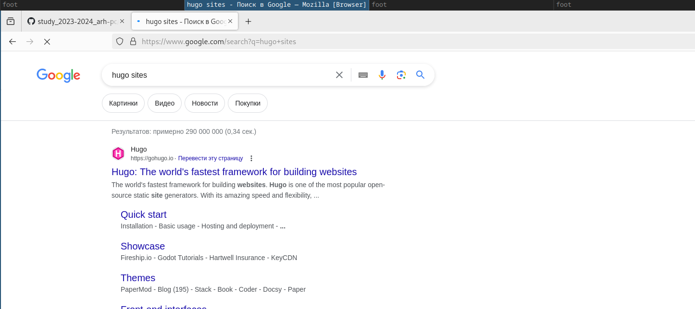{#fig:001 width=70%}

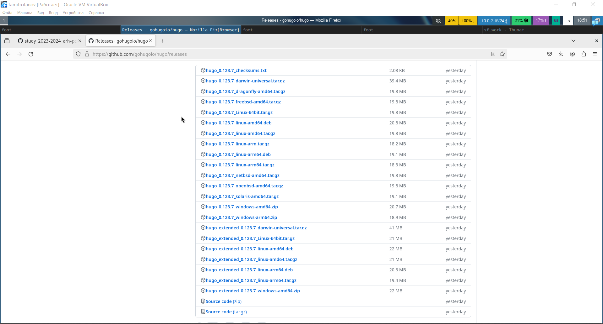{#fig:002 width=70%}

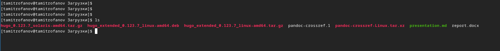{#fig:003 width=70%}

##

Распаковывваем скаченый архив с hugo.

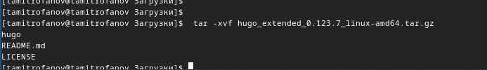{#fig:004 width=70%}

##

Переносим программу в необходимый для её работы репозиторий.

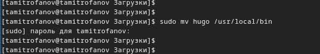{#fig:005 width=70%}

##

Теперь создадим свой репозиторий на github. Назовём его blog.

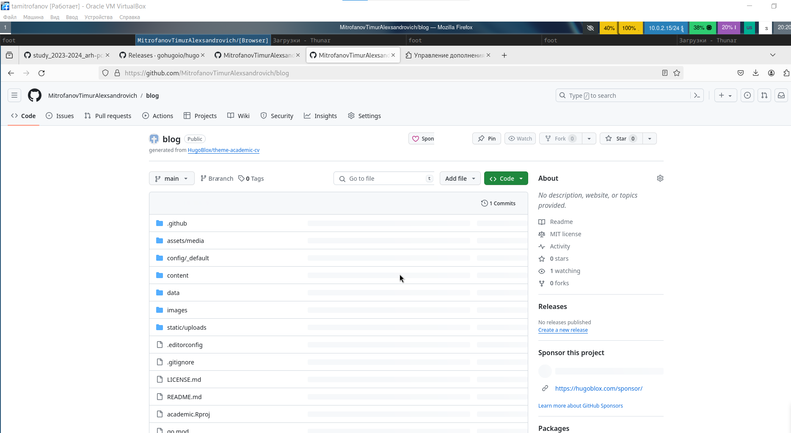{#fig:006 width=70%}

##

Клонируем наш репозиторий в файлы операционной системы.

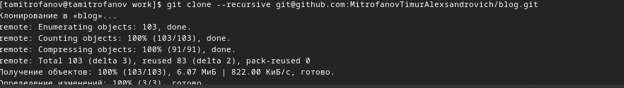{#fig:007 width=70%}

##

Установим go который нужен для работы hugo.

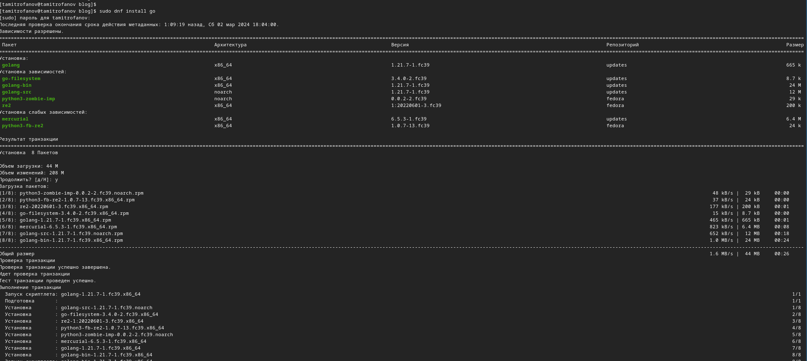{#fig:008 width=70%}

##

Инициализируем hugo в нашем репозитории blog.

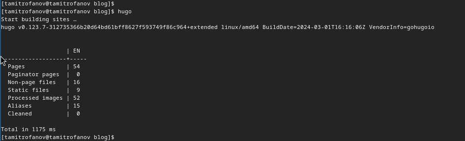{#fig:009 width=70%}

##

Из репозитория удаляем не нужный дерикторий public

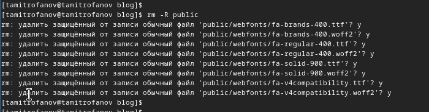{#fig:010 width=70%}

##

Запускаем локальный сервер hugo при помощи команды ***hugo server*** Для проверки работы.

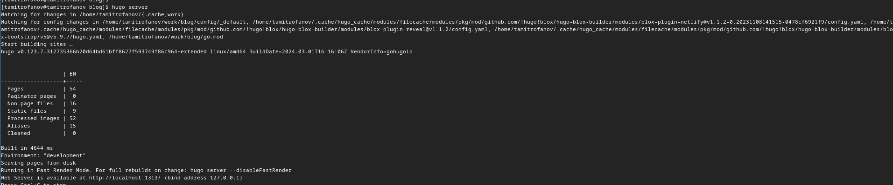{#fig:011 width=70%}

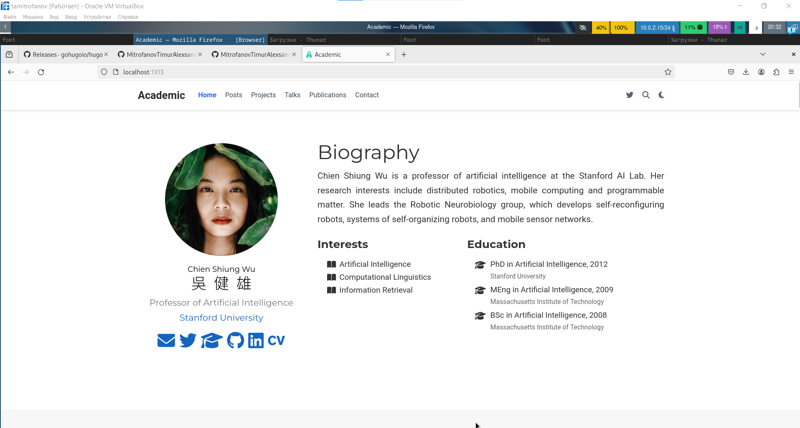{#fig:012 width=70%}

##

Для размещения визитки на github создадим ещё один репозиторий **MitrofanovTimurAlexandrovich.github.io** 

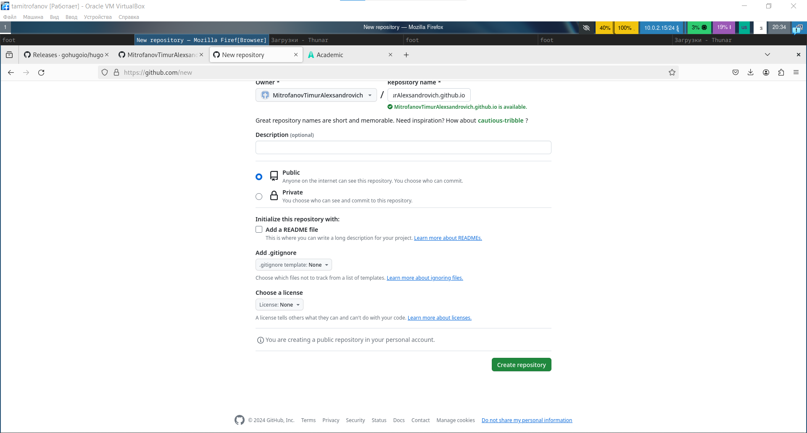{#fig:013 width=70%}

##

После как и предыдущий репозиторий клонируем его в оперционную систему с сайта при помощи ***git clone***. Затем создаём там новую ветку. 

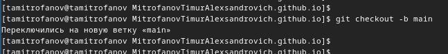{#fig:014 width=70%}

##

Создаём там стандартный файл *README* 

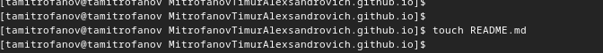{#fig:015 width=70%}

##

При помщи стандартных команд ***add***, ***commit*** и ***push*** добавляем соответствующие изменения на сервер.

{#fig:016 width=70%}

##

Перейдём в файл конфигурации игнорирования пути нашего репозитория в репозитории blog и отключим игнорирования для **public**. 

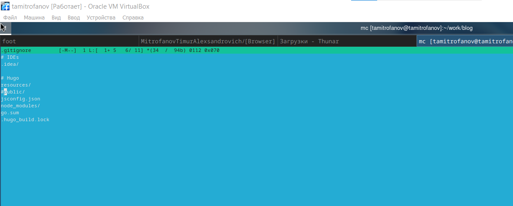{#fig:017 width=70%}

##

Создадим новый раздел public в замен раннее удалённого.

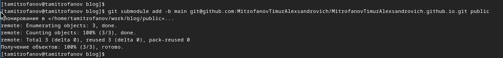{#fig:018 width=70%}

##

Теперь проверим наличие всех нобходимых веток и их работоспособность

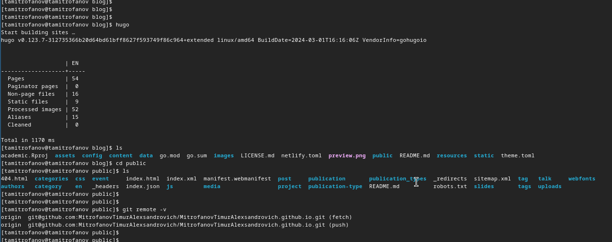{#fig:019 width=70%}

##

Загружаем все изменения на сервер

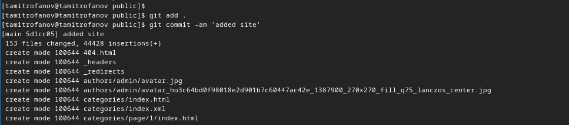{#fig:020 width=70%}

##

Проверяем работу сайта на github

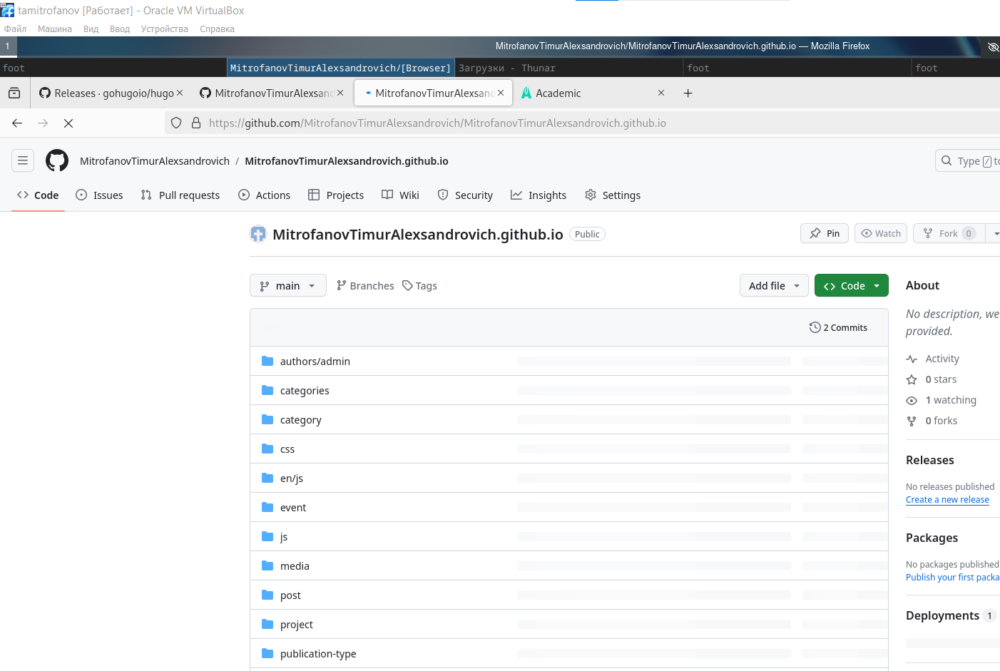{#fig:021 width=70%}

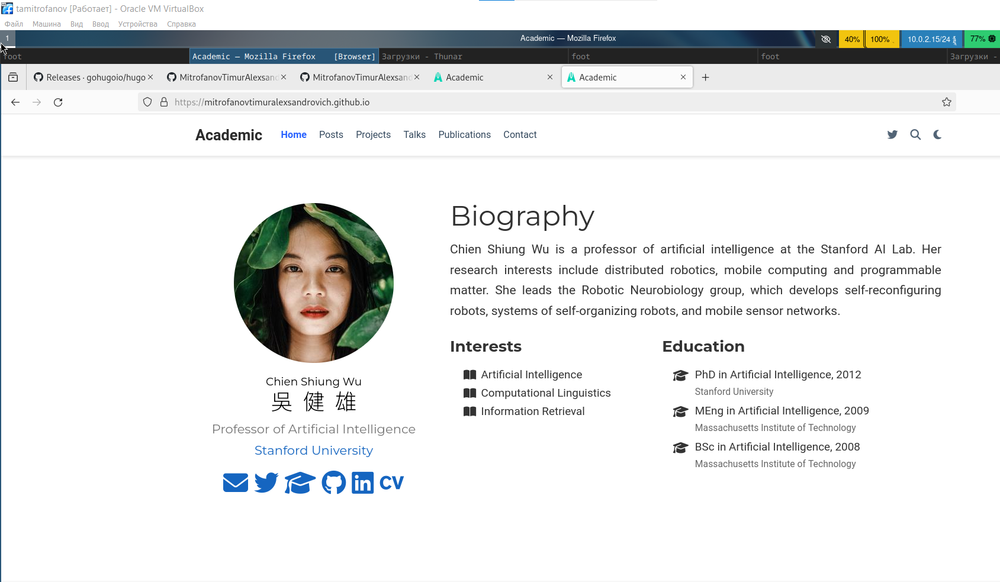{#fig:022 width=70%}

##

Проверяем работу сайта на github

# Выводы

Сегодня я разместил на Github pages заготовки для персонального сайта.
