---
## Front matter
title: "Отчёт о выполнении. Индивидуальный проект."
subtitle: "Этап 1"
author: "Митрофанов Тимур Александрович"

## Generic otions
lang: ru-RU
toc-title: "Содержание"

## Bibliography
bibliography: bib/cite.bib
csl: pandoc/csl/gost-r-7-0-5-2008-numeric.csl

## Pdf output format
toc: true # Table of contents
toc-depth: 2
lof: true # List of figures
fontsize: 12pt
linestretch: 1.5
papersize: a4
documentclass: scrreprt
## I18n polyglossia
polyglossia-lang:
  name: russian
  options:
	- spelling=modern
	- babelshorthands=true
polyglossia-otherlangs:
  name: english
## I18n babel
babel-lang: russian
babel-otherlangs: english
## Fonts
mainfont: PT Serif
romanfont: PT Serif
sansfont: PT Sans
monofont: PT Mono
mainfontoptions: Ligatures=TeX
romanfontoptions: Ligatures=TeX
sansfontoptions: Ligatures=TeX,Scale=MatchLowercase
monofontoptions: Scale=MatchLowercase,Scale=0.9
## Biblatex
biblatex: true
biblio-style: "gost-numeric"
biblatexoptions:
  - parentracker=true
  - backend=biber
  - hyperref=auto
  - language=auto
  - autolang=other*
  - citestyle=gost-numeric
## Pandoc-crossref LaTeX customization
figureTitle: "Рис."
tableTitle: "Таблица"
lofTitle: "Список иллюстраций"
## Misc options
indent: true
header-includes:
  - \usepackage{indentfirst}
  - \usepackage{float} # keep figures where there are in the text
  - \floatplacement{figure}{H} # keep figures where there are in the text
---

# Цель работы

Размещение на Github pages заготовки для персонального сайта.

# Задание

-Установить необходимое программное обеспечение.
-Скачать шаблон темы сайта.
-Разместить его на хостинге git.
-Установить параметр для URLs сайта.
-Разместить заготовку сайта на Github pages.

# Выполнение лабораторной работы

Скачиваем hugo для последующей работы с шаблонми (рис. [-@fig:001], рис. [-@fig:002] и рис. [-@fig:003]).

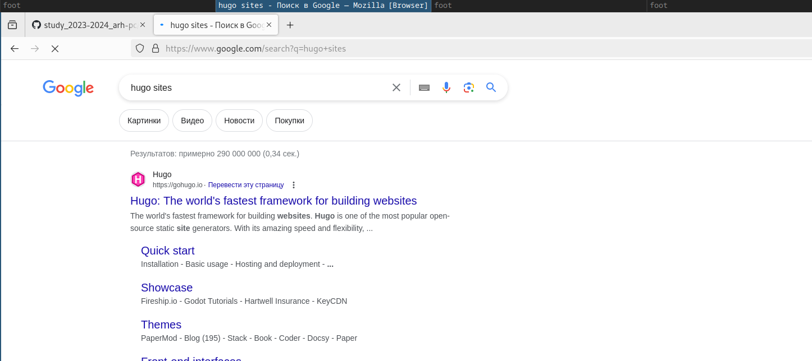{#fig:001 width=70%}

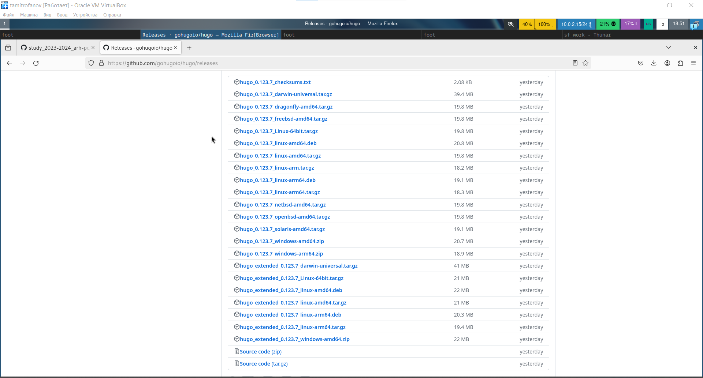{#fig:002 width=70%}

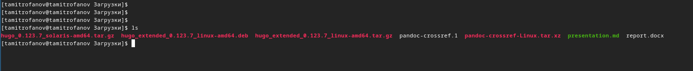{#fig:003 width=70%}

Распаковывваем скаченый архив с hugo. (рис. [-@fig:004])

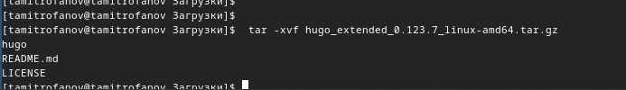{#fig:004 width=70%}

Переносим программу в необходимый для её работы репозиторий. (рис. [-@fig:005])

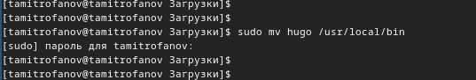{#fig:005 width=70%}

Теперь создадим свой репозиторий на github. Назовём его blog. (рис. [-@fig:006])

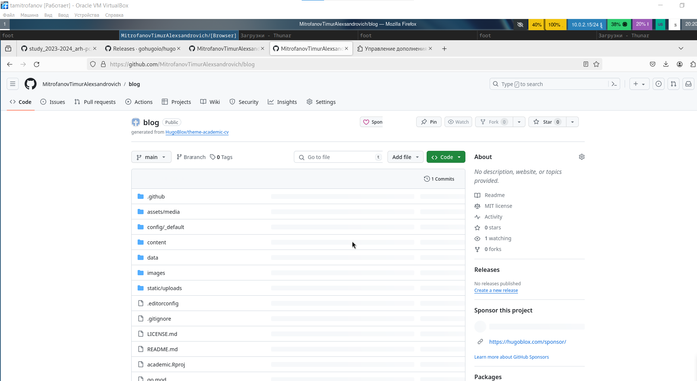{#fig:006 width=70%}

Клонируем наш репозиторий в файлы операционной системы. (рис. [-@fig:007])

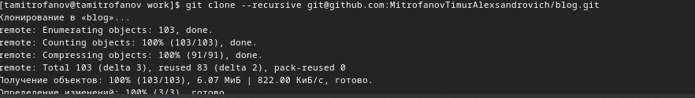{#fig:007 width=70%}

Установим go который нужен для работы hugo. (рис. [-@fig:008])

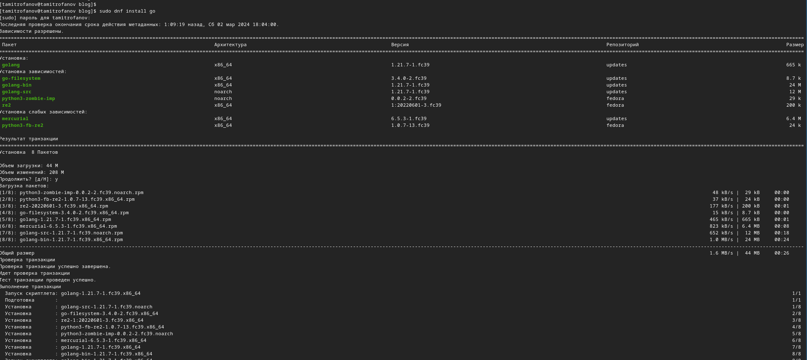{#fig:008 width=70%}

Инициализируем hugo в нашем репозитории blog. (рис. [-@fig:009])

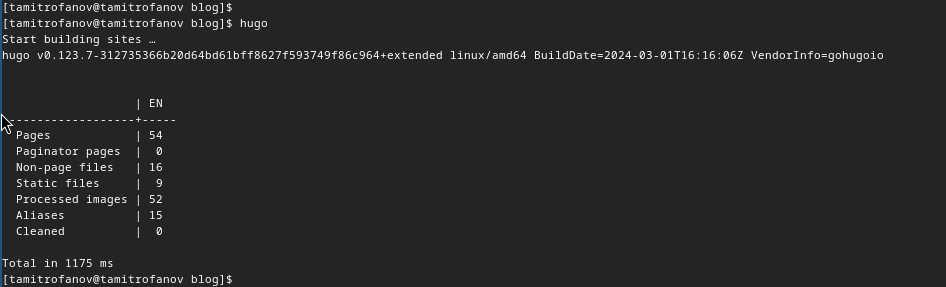{#fig:009 width=70%}

Из репозитория удаляем не нужный дерикторий public(рис. [-@fig:010])

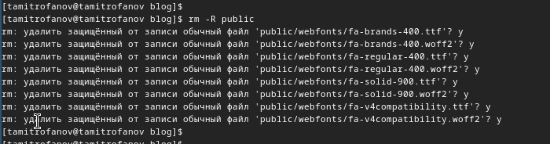{#fig:010 width=70%}

Запускаем локальный сервер hugo при помощи команды ***hugo server*** Для проверки работы. (рис. [-@fig:011] и рис. [-@fig:012])

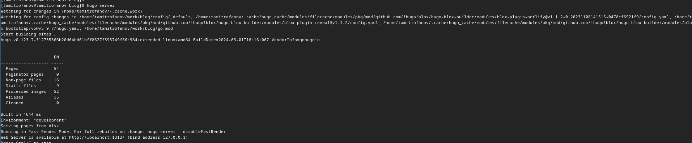{#fig:011 width=70%}

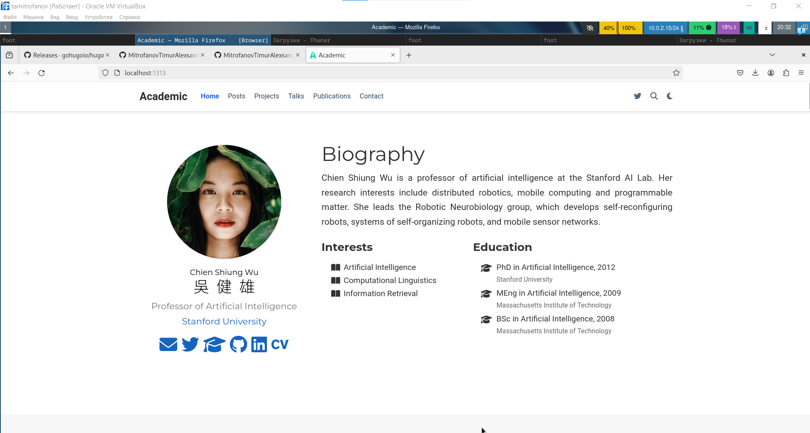{#fig:012 width=70%}

Для размещения визитки на github создадим ещё один репозиторий **MitrofanovTimurAlexandrovich.github.io** (рис. [-@fig:013])

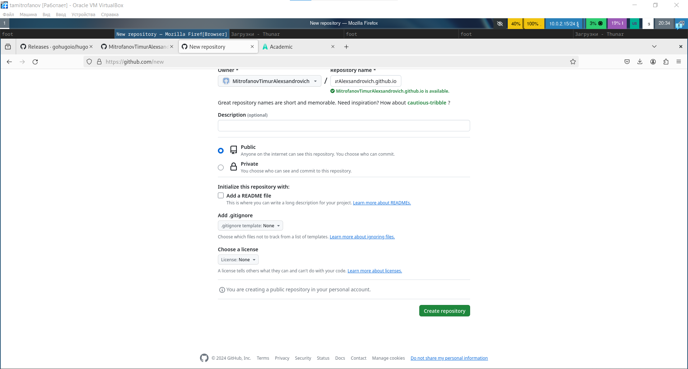{#fig:013 width=70%}

После как и предыдущий репозиторий клонируем его в оперционную систему с сайта при помощи ***git clone***. Затем создаём там новую ветку. (рис. [-@fig:014])

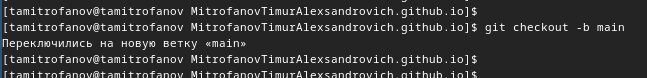{#fig:014 width=70%}

Создаём там стандартный файл *README* (рис. [-@fig:015])

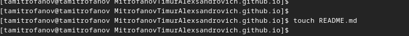{#fig:015 width=70%}

При помщи стандартных команд ***add***, ***commit*** и ***push*** добавляем соответствующие изменения на сервер. (рис. [-@fig:016])

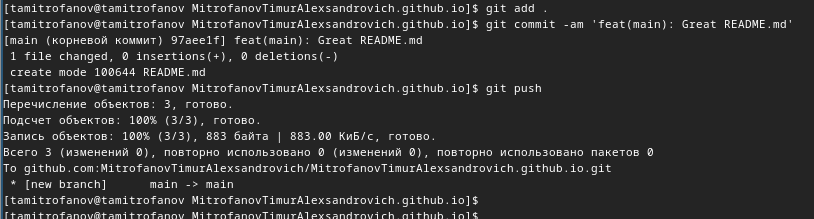{#fig:016 width=70%}

Перейдём в файл конфигурации игнорирования пути нашего репозитория в репозитории blog и отключим игнорирования для **public**. (рис. [-@fig:017])

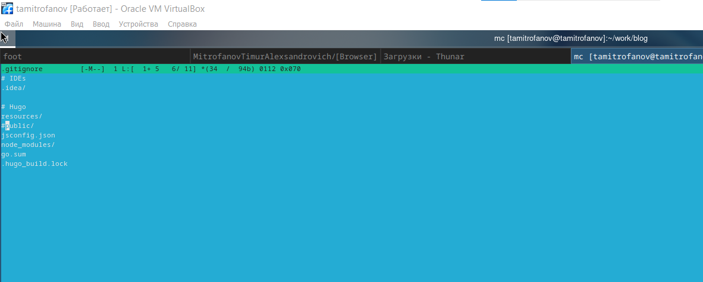{#fig:017 width=70%}

Создадим новый раздел public в замен раннее удалённого.(рис. [-@fig:018])

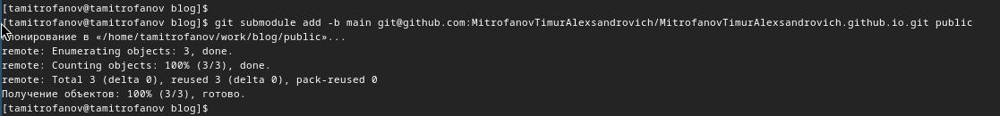{#fig:018 width=70%}

Теперь проверим наличие всех нобходимых веток и их работоспособность(рис. [-@fig:019])

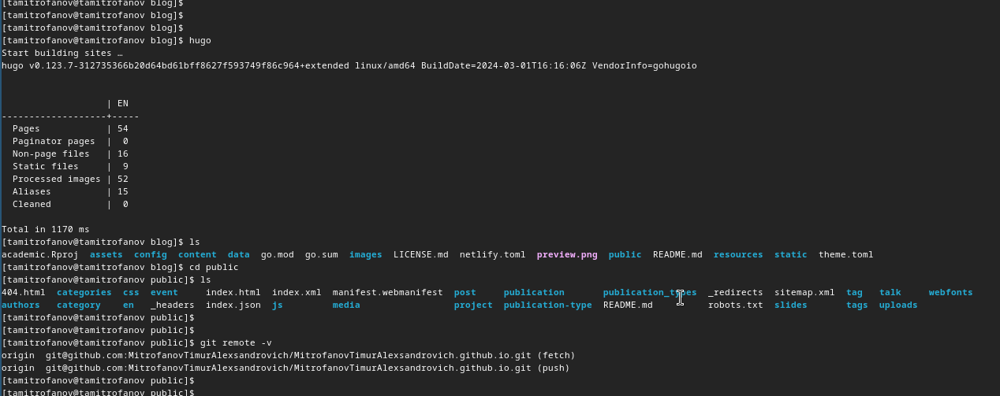{#fig:019 width=70%}

Загружаем все изменения на сервер(рис. [-@fig:020])

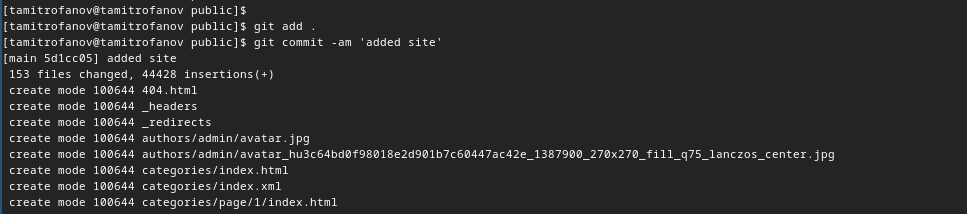{#fig:020 width=70%}

Проверяем работу сайта на github(рис. [-@fig:021] и рис. [-@fig:022])

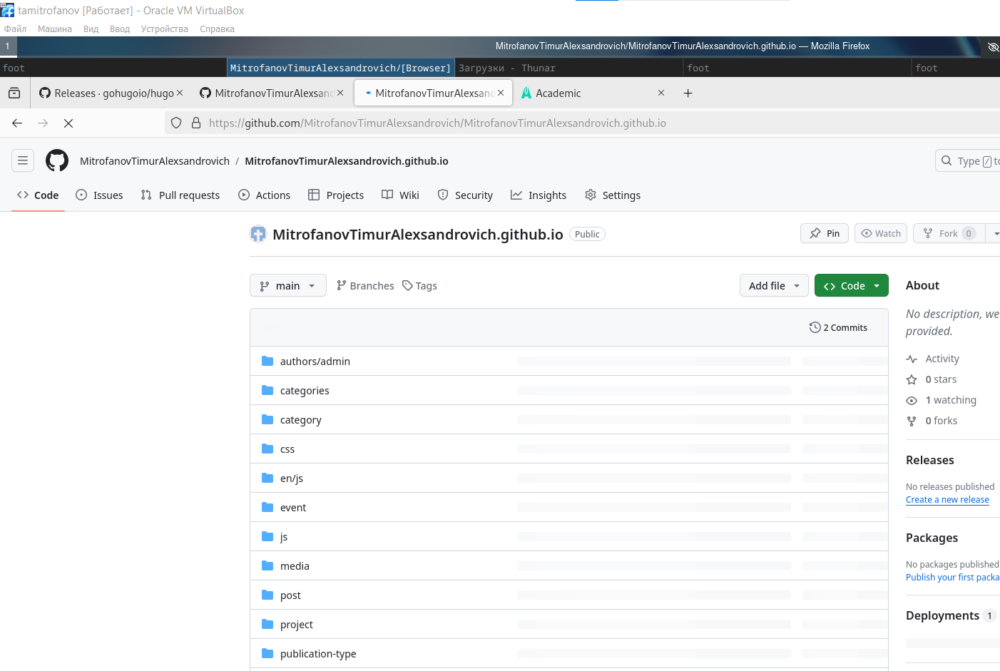{#fig:021 width=70%}

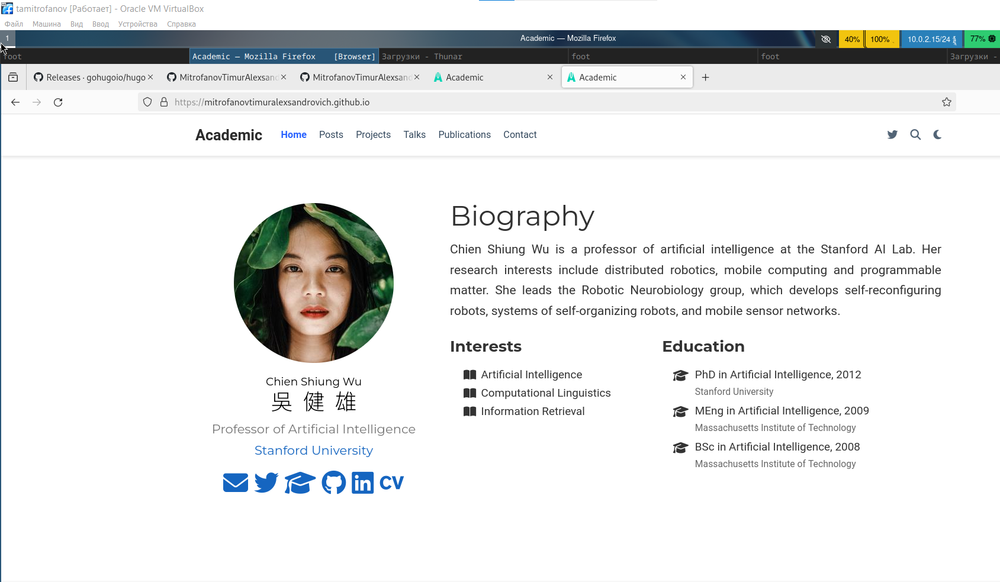{#fig:022 width=70%}

Проверяем работу сайта на github

# Выводы

Сегодня я разместил на Github pages заготовки для персонального сайта.

