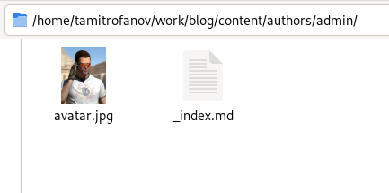
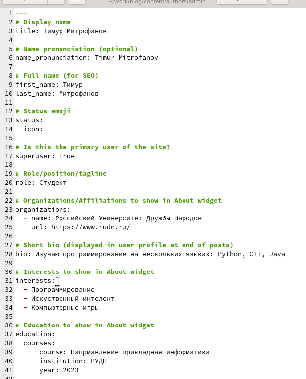
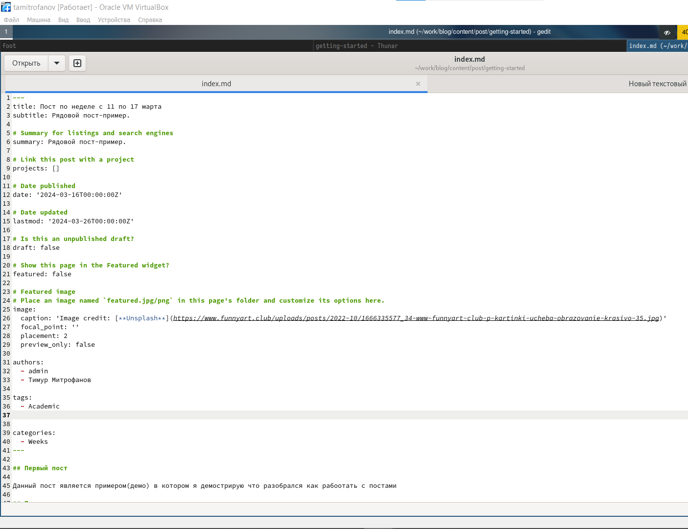
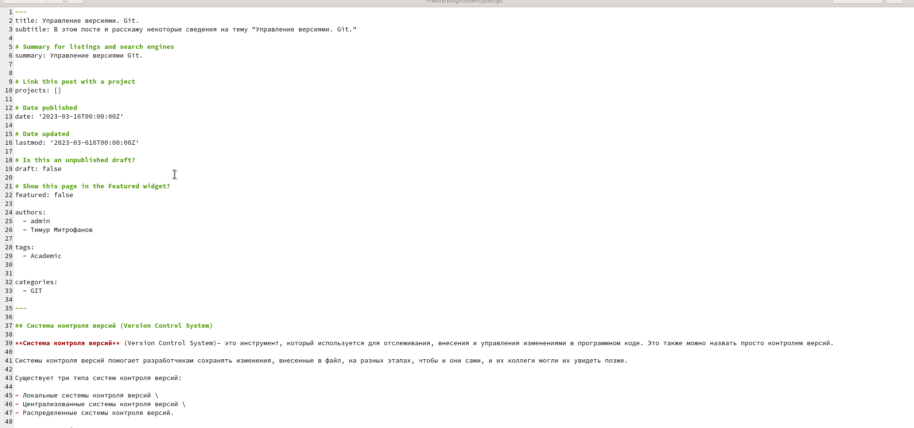
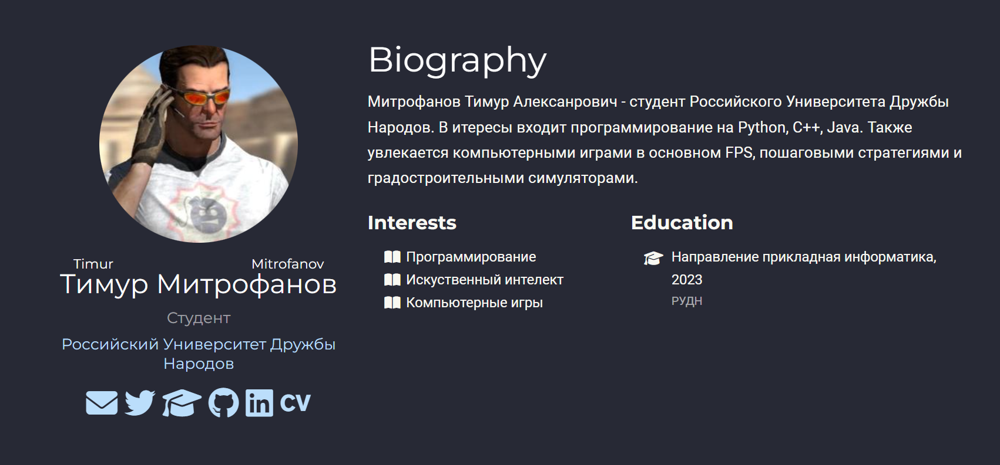

---
## Front matter
lang: ru-RU
title: "Презентация о выполнении. Индивидуальный проект."
subtitle: "Этап 2"
author:
  - "Митрофанов Тимур Александрович"
institute:
  - Российский университет дружбы народов, Москва, Россия

date: 02 марта 2024

## i18n babel
babel-lang: russian
babel-otherlangs: english

## Formatting pdf
toc: false
toc-title: Содержание
slide_level: 2
aspectratio: 169
section-titles: true
theme: metropolis
header-includes:
 - \metroset{progressbar=frametitle,sectionpage=progressbar,numbering=fraction}
 - '\makeatletter'
 - '\beamer@ignorenonframefalse'
 - '\makeatother'
 ## Fonts
mainfont: PT Serif
romanfont: PT Serif
sansfont: PT Sans
monofont: PT Mono
mainfontoptions: Ligatures=TeX
romanfontoptions: Ligatures=TeX
sansfontoptions: Ligatures=TeX,Scale=MatchLowercase
monofontoptions: Scale=MatchLowercase,Scale=0.9
---

# Информация

## Докладчик

:::::::::::::: {.columns align=center}
::: {.column width="70%"}

  * Митрофанов Тимур Александрович
  * Российский университет дружбы народов
  * [1132231842@pfur.ru](1132231842@pfur.ru)

:::
::: {.column width="30%"}

:::
::::::::::::::

# Цель работы

Добавление информации об авторе и первые посты.

# Выполнение лабораторной работы

Заменим фотографию полтзователся на свою

{#fig:001 width=70%}

##

В находящимся тамже репозитории изменим данные об авторе

{#fig:002 width=70%}

##

Сделаем первый пост о прошедшей неделе

{#fig:003 width=70%}

##

Сделаем пост про git

{#fig:004 width=70%}

##

Полсе коммита всех изменений и ново-ведений мжно увидеть изменения на сайте

{#fig:005 width=70%}

# Выводы

Сегодня я добавил информацию об авторе и первые посты.
